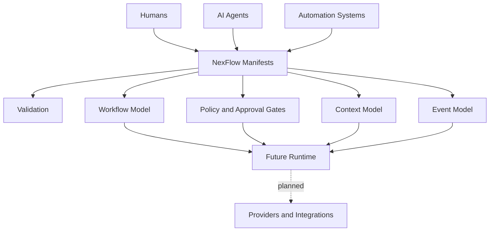

# NexFlow


**Open specification and orchestration framework for AI developer teams.**

NexFlow is a specification-first project for describing how humans, AI agents, automation systems, tools, context sources, approvals, and workflows cooperate on software projects.

It is **not** an AI coding agent, an LLM API wrapper, a chat application, or a personal productivity tool. The specification is the product. Runtimes, CLIs, and orchestration engines are future work.

## Status

| Area | Status |
| --- | --- |
| Core concepts | Specified in draft form |
| YAML manifests | Specified in draft form |
| JSON Schemas | Implemented as practical draft schemas |
| Repository schema validation | Implemented for all reference manifests |
| Examples | Implemented as reference examples |
| Agent assembly | Specified as draft behavior versioning vocabulary |
| Agent definitions | Specified as draft agent assembly components |
| Model profiles | Specified as draft provider-neutral vocabulary |
| Prompt sets | Specified as draft prompt versioning vocabulary |
| Retrieval profiles | Specified as draft context retrieval vocabulary |
| Governance and RFC process | Implemented in documentation |
| Runtime engine | Planned, not implemented |
| Provider integrations | Planned, not implemented |
| Reference CLI | Planned, not implemented |

Current spec version: **0.1 draft**

## Repository History Note

This repository was recreated on June 23, 2026 after personal files were accidentally committed during early bootstrapping.

The repository history was sanitized and republished with original commit author dates preserved where possible. Old pull request links from the previous repository instance should be considered obsolete.

No project specification content was intentionally removed as part of this cleanup.

## Problem

Software teams increasingly include humans, AI agents, CI systems, external tools, and automation services. Today, every tool describes agents, prompts, skills, memory, permissions, context, tasks, and workflow state differently.

That fragmentation makes it difficult to:

- audit what an agent is allowed to do
- understand which context sources are available
- coordinate work across tools
- hand work from one actor to another
- enforce approval gates
- preserve human authority
- compare or migrate between providers and runtimes

## Solution

NexFlow defines a common declarative layer for AI developer teams:

- **Team Structure as Code** for agents, roles, responsibilities, and skills
- **Agent Definition as Code** for versioned behavioral releases assembled from models, prompts, retrieval, permissions, memory, autonomy, and extensions
- **Workflow as Code** for tasks, dependencies, handoffs, and approvals
- **Context as Code** for repositories, docs, issue trackers, design systems, and knowledge bases
- **Permission as Code** for capabilities, access, and dangerous actions
- **Memory as Code** for retention, ownership, visibility, and allowed consumers
- **Model Profile as Code** for provider-neutral model selection, constraints, fallback, and audit expectations
- **Prompt Set as Code** for prompt revisions, source references, ownership, safety review, and compatibility impact
- **Retrieval Profile as Code** for context sources, index versions, chunking, freshness, citations, and audit expectations
- **Integration as Code** for provider-neutral extensions

The goal is to make AI-assisted software delivery inspectable before anything runs.

## Core Concepts

- **Project**: the repository, product, or workstream governed by NexFlow manifests.
- **Team**: humans, agents, automation systems, and review authorities.
- **Agent**: a declared AI participant with role, responsibilities, skills, access, and autonomy.
- **Agent Assembly**: a reviewable behavioral release that links an agent identity to versioned model, prompt, retrieval, permission, context, memory, autonomy, and extension references.
- **Agent Definition**: a versioned behavioral release of an agent assembled from model, prompt, retrieval, permission, context, memory, autonomy, and extension references.
- **Capability**: something an actor can technically do, such as `read_repository` or `create_pull_request`.
- **Permission**: a policy decision allowing, denying, or gating a capability.
- **Context Source**: a repository, docs system, issue tracker, design file, web source, MCP server, or custom data source.
- **Memory Scope**: a declared retention and visibility boundary for remembered information.
- **Model Profile**: a provider-neutral model selection profile with pinned, floating, or policy-based selection and audit expectations.
- **Prompt Set**: versioned prompt material with source references, revisions, safety review, compatibility impact, and audit expectations.
- **Retrieval Profile**: versioned retrieval expectations for context sources, indexes, chunking, freshness, citations, sensitivity, and audit.
- **Workflow**: an ordered or event-driven set of tasks, dependencies, gates, and handoffs.
- **Handoff**: a structured transfer of responsibility between actors.
- **Event**: an auditable state transition such as `task.completed` or `review.requested`.
- **Extension**: a namespaced integration surface for tools such as GitHub, Linear, Figma, Slack, MCP, or custom systems.

See [Concepts](docs/concepts.md) for the full domain model and [Glossary](docs/glossary.md) for quick terminology reference.

## Manifest Example

```yaml
specVersion: "0.1"
kind: AgentSet
metadata:
  project: nexflow-example
agents:
  - id: docs-architect
    displayName: Documentation Architect
    role: technical_writer
    description: Maintains specification clarity and example consistency.
    responsibilities:
      - Keep docs, schemas, and examples aligned.
      - Flag behavior that is not represented in the specification.
    skills:
      - specification_writing
      - schema_review
    capabilities:
      - read_repository
      - modify_documentation
      - read_context
    permissions:
      - docs_write_with_review
    contextAccess:
      - repository
      - docs
    memoryAccess:
      - ephemeral
      - project
    autonomyLevel: ask_before_changes
    providerPreferences:
      - provider: any
        priority: preferred
    extensions: []
```

## Architecture



NexFlow is intentionally split into layers:

1. **Specification**: stable language-independent model and manifest semantics.
2. **Schemas**: practical JSON Schemas for validation.
3. **Examples**: reference teams and workflows.
4. **Runtime**: future implementation that interprets the manifests.
5. **Products**: possible future desktop, cloud, and hosted orchestration layers.

## Repository Map

- [docs/](docs/index.md): specification documentation
- [schemas/](schemas/): draft JSON Schemas for core manifests
- [Schema Guide](schemas/README.md): schema scope, update rules, and validation boundaries
- [examples/](examples/): complete reference team configurations
- [Examples Guide](examples/README.md): overview of reference teams and manifest file sets
- [rfcs/](rfcs/README.md): governance and design proposal process
- [Conformance](docs/conformance.md): draft support levels for manifests, validators, CLIs, runtimes, and extensions
- [CONTRIBUTING.md](CONTRIBUTING.md): contribution workflow
- [SECURITY.md](SECURITY.md): vulnerability and safety reporting policy

## Specification Guide

| Need | Start Here |
| --- | --- |
| Understand the vocabulary | [Concepts](docs/concepts.md), [Glossary](docs/glossary.md) |
| See every manifest shape | [Manifest Reference](docs/manifest-reference.md) |
| Understand safety boundaries | [Security Model](docs/security-model.md), [Approval Gates](docs/approval-gates.md) |
| Version agent behavior | [Agent Assembly](docs/agent-assembly.md), [Agent Definitions](docs/agent-definitions.md), [Versioning](docs/versioning.md), [Event Model](docs/events.md) |
| Model what agents can and may do | [Capability Model](docs/capability-model.md), [Autonomy Model](docs/autonomy-model.md) |
| Model what agents may know or retain | [Context Model](docs/context-model.md), [Memory Model](docs/memory-model.md) |
| Model provider-neutral model selection | [Model Profiles](docs/model-profiles.md), [Provider Abstraction](docs/provider-abstraction.md), [Versioning](docs/versioning.md) |
| Model prompt revisions and safety review | [Prompt Sets](docs/prompt-sets.md), [Versioning](docs/versioning.md), [Event Model](docs/events.md) |
| Model retrieval, freshness, and citations | [Retrieval Profiles](docs/retrieval-profiles.md), [Context Model](docs/context-model.md), [Event Model](docs/events.md) |
| Validate manifests | [Validation](docs/validation.md), [Schema Guide](schemas/README.md), [Conformance](docs/conformance.md) |
| Extend or integrate NexFlow | [Extension Model](docs/extensions.md), [Integrations](docs/integrations.md), [Provider Abstraction](docs/provider-abstraction.md) |
| Review future implementation choices | [Runtime Options](docs/runtime-options.md), [Roadmap](docs/roadmap.md) |

## Roadmap

1. Stabilize the draft `0.1` manifest vocabulary.
2. Collect feedback through RFCs.
3. Improve schemas and example coverage.
4. Define conformance expectations.
5. Complete the **Runtime Architecture Decision** milestone.
6. Build a reference validation CLI.
7. Explore runtime prototypes without locking the specification to one language.

See [Roadmap](docs/roadmap.md).

## Governance Summary

NexFlow uses an RFC process for material changes. Breaking changes require migration notes, compatibility impact, and review by maintainers. Runtime implementations must not introduce behavior that is absent from the specification.

See [Governance](docs/governance.md) and [RFCs](rfcs/README.md).

## Known Limitations

- The current schemas are practical drafts, not complete formal semantics.
- No runtime engine exists yet.
- Provider and integration support is described, not implemented.
- Repository schema validation is implemented for reference manifests; cross-manifest semantic validation is not yet implemented.
- Security behavior is normative for future runtimes, but not enforced by this repository alone.

## FAQ

**Is NexFlow an agent?**  
No. NexFlow describes agents and workflows.

**Does NexFlow call LLM providers?**  
No. Provider abstraction is specified, but no provider integration is implemented.

**Can this work without a runtime?**  
Yes. Teams can use NexFlow manifests as auditable documentation, planning artifacts, and reviewable policy.

**Why YAML?**  
YAML is readable in repositories and familiar to software teams. JSON compatibility is preserved through schemas.

**Which license does NexFlow use?**  
MIT. The goal is broad adoption across hobby, commercial, research, and enterprise contexts.

## Contributing

Start with [CONTRIBUTING.md](CONTRIBUTING.md). Changes that alter the model, manifests, schemas, or compatibility expectations should go through the RFC process.

## License

NexFlow is licensed under the [MIT License](LICENSE).
