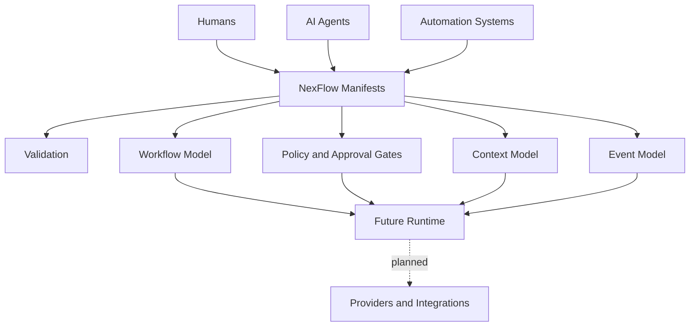

# NexFlow


**Open specification and orchestration framework for AI developer teams.**

NexFlow is a specification-first project for describing how humans, AI agents, automation systems, tools, context sources, approvals, and workflows cooperate on software projects.

It is **not** an AI coding agent, an LLM API wrapper, a chat application, or a personal productivity tool. The specification is the product. Runtimes, CLIs, and orchestration engines are future work.

## Status

Current release posture: **`0.1` draft, preparing for candidate review**. No
`0.1` candidate tag has been published.

| Surface | Current State | Evidence |
| --- | --- | --- |
| Specification | Specified in draft form | [Documentation](docs/index.md), [Manifest Reference](docs/manifest-reference.md) |
| JSON Schemas | Implemented for 17 manifest kinds plus common definitions | [Schemas](schemas/), [Schema Guide](schemas/README.md) |
| Reference examples | Implemented as 7 project sets containing 113 schema-backed manifests | [Examples](examples/), [Examples Guide](examples/README.md) |
| Structural validation | Implemented for all maintained examples plus ActorSet boundary cases | `npm run validate`, `npm run actor-schema-smoke` |
| Semantic reference checks | Partial repository smoke coverage | `npm run semantic-smoke`, [Validation](docs/validation.md) |
| Governance and RFC process | Implemented in documentation | [Governance](docs/governance.md), [RFCs](rfcs/README.md) |
| Foundational model changes | First ActorSet migration slice implemented; RFCs remain Draft | [Actor Model](docs/actor-model.md), [Foundational Model Review](rfcs/reviews/2026-07-foundational-model-review.md) |
| Reference CLI | Planned, not implemented | [RFC-0011](rfcs/RFC-0011-reference-cli-scope.md) |
| Runtime and provider execution | Planned, not implemented | [Architecture](docs/architecture.md), [Runtime Options](docs/runtime-options.md) |
| Live integrations and extension loading | Not implemented | [Compatibility Matrix](docs/compatibility-matrix.md) |

Today, NexFlow can be used to author and review declarative team manifests,
validate the maintained examples structurally, and run limited cross-manifest
reference checks. It cannot execute tasks, call model providers, enforce policy,
load extensions, or orchestrate workflows.

See the [Compatibility Matrix](docs/compatibility-matrix.md) for the exact tested
artifact pairing and the [0.1 Readiness Checklist](docs/readiness-checklist.md)
for candidate criteria. `Specified`, `Partial`, and `Implemented` are distinct
support claims; documented future behavior is not an implementation claim.

## Repository History Note

This repository was recreated on June 23, 2026 after personal files were accidentally committed during early bootstrapping.

The repository history was sanitized and republished with original commit author dates preserved where possible. Old pull request links from the previous repository instance should be considered obsolete.

No project specification content was intentionally removed as part of this cleanup.

## Problem

Software teams increasingly include humans, AI agents, CI systems, external tools, and automation services. Today, every tool describes agents, prompts, skills, memory, permissions, context, tasks, and workflow state differently.

That fragmentation makes it difficult to:

- audit what an agent is allowed to do
- understand which context sources are available
- coordinate work across tools
- hand work from one actor to another
- enforce approval gates
- preserve human authority
- compare or migrate between providers and runtimes

## Solution

NexFlow defines a common declarative layer for AI developer teams:

- **Team Structure as Code** for typed human, agent, automation, service, and authority identities, roles, responsibilities, and skills
- **Agent Definition as Code** for versioned behavioral releases assembled from models, prompts, retrieval, permissions, memory, autonomy, and extensions
- **Workflow as Code** for tasks, dependencies, handoffs, and approvals
- **Context as Code** for repositories, docs, issue trackers, design systems, and knowledge bases
- **Permission as Code** for capabilities, access, and dangerous actions
- **Memory as Code** for retention, ownership, visibility, and allowed consumers
- **Model Profile as Code** for provider-neutral model selection, constraints, fallback, and audit expectations
- **Prompt Set as Code** for prompt revisions, source references, ownership, safety review, and compatibility impact
- **Retrieval Profile as Code** for context sources, index versions, chunking, freshness, citations, and audit expectations
- **Integration as Code** for provider-neutral extensions

The goal is to make AI-assisted software delivery inspectable before anything runs.

## Core Concepts

- **Project**: the repository, product, or workstream governed by NexFlow manifests.
- **Team**: humans, agents, automation systems, and review authorities.
- **Actor**: a first-class human, agent, automation, service, or authority identity participating in project work.
- **Agent**: a stable AI identity with a role, responsibilities, and skills; versioned behavior belongs to agent definitions.
- **Agent Assembly**: the cross-manifest relationship and review checkpoint connecting an agent identity, an agent definition, and its referenced behavioral components.
- **Agent Definition**: a versioned behavioral release of an agent assembled from model, prompt, retrieval, permission, context, memory, autonomy, and extension references.
- **Capability**: something an actor can technically do, such as `read_repository` or `create_pull_request`.
- **Permission**: a policy rule with an `allow`, `deny`, or `approval_required` effect for capabilities.
- **Context Source**: a repository, docs system, issue tracker, design file, web source, MCP server, or custom data source.
- **Memory Scope**: a declared retention and visibility boundary for remembered information.
- **Model Profile**: a provider-neutral model selection profile with pinned, floating, or policy-based selection and audit expectations.
- **Prompt Set**: versioned prompt material with source references, revisions, safety review, compatibility impact, and audit expectations.
- **Retrieval Profile**: versioned retrieval expectations for context sources, indexes, chunking, freshness, citations, sensitivity, and audit.
- **Workflow**: an ordered or event-driven set of tasks, dependencies, gates, and handoffs.
- **Handoff**: a structured transfer of responsibility between actors.
- **Event**: an auditable state transition such as `task.completed` or `review.requested`.
- **Extension**: a namespaced integration surface for tools such as GitHub, Linear, Figma, Slack, MCP, or custom systems.

See [Concepts](docs/concepts.md) for the full domain model and [Glossary](docs/glossary.md) for quick terminology reference.

## Manifest Example

```yaml
specVersion: "0.1"
kind: ActorSet
metadata:
  project: nexflow-example
actors:
  - id: human-maintainer
    kind: human
    displayName: Human Maintainer
    description: Final human authority for accepted project changes.
    roles:
      - maintainer
    responsibilities:
      - Review proposed changes.
  - id: docs-architect
    kind: agent
    displayName: Documentation Architect
    description: AI participant that maintains specification clarity.
    roles:
      - technical_writer
    responsibilities:
      - Keep docs, schemas, and examples aligned.
      - Flag behavior that is not represented in the specification.
    skills:
      - specification_writing
      - schema_review
    agentRef:
      kind: agent
      id: docs-architect
```

## Architecture



NexFlow is intentionally split into layers:

1. **Specification**: stable language-independent model and manifest semantics.
2. **Schemas**: practical JSON Schemas for validation.
3. **Examples**: reference teams and workflows.
4. **Runtime**: future implementation that interprets the manifests.
5. **Products**: possible future desktop, cloud, and hosted orchestration layers.

## Repository Map

- [Documentation Index](docs/index.md): specification documentation and reading paths
- [schemas/](schemas/): draft JSON Schemas for core manifests
- [Schema Guide](schemas/README.md): schema scope, update rules, and validation boundaries
- [examples/](examples/): complete reference team configurations
- [Examples Guide](examples/README.md): overview of reference teams and manifest file sets
- [rfcs/](rfcs/README.md): governance and design proposal process
- [Foundational Model Review](rfcs/reviews/2026-07-foundational-model-review.md): compatibility, safety, blockers, and implementation order for RFC-0013 through RFC-0016
- [Conformance](docs/conformance.md): draft support levels for manifests, validators, CLIs, runtimes, and extensions
- [Compatibility Matrix](docs/compatibility-matrix.md): current support and explicit implementation gaps
- [Validation](docs/validation.md): repository checks and their boundaries
- [Actor Model](docs/actor-model.md): first-class participant identity and kind-specific relationships
- [Actor Model Migration](docs/actor-model-migration.md): staged transition from mixed AgentSet identity
- [Network Access Policy](docs/network-access-policy.md): fail-closed outbound connection rules and migration from advisory strings
- [Release Plan](docs/release-plan.md): public readiness criteria from `0.1` draft through `1.0`
- [0.1 Readiness Checklist](docs/readiness-checklist.md): candidate review checklist for docs, schemas, examples, RFCs, compatibility, and limitations
- [CONTRIBUTING.md](CONTRIBUTING.md): contribution workflow
- [SECURITY.md](SECURITY.md): vulnerability and safety reporting policy

## Specification Guide

| Need | Start Here |
| --- | --- |
| Understand the vocabulary | [Concepts](docs/concepts.md), [Glossary](docs/glossary.md) |
| Model participant identity | [Actor Model](docs/actor-model.md), [Actor Model Migration](docs/actor-model-migration.md) |
| See every manifest shape | [Manifest Reference](docs/manifest-reference.md) |
| Understand safety boundaries | [Security Model](docs/security-model.md), [Network Access Policy](docs/network-access-policy.md), [Approval Gates](docs/approval-gates.md) |
| Version agent behavior | [Agent Assembly](docs/agent-assembly.md), [Agent Definitions](docs/agent-definitions.md), [Versioning](docs/versioning.md), [Event Model](docs/events.md) |
| Model what agents can and may do | [Capability Model](docs/capability-model.md), [Autonomy Model](docs/autonomy-model.md) |
| Model what agents may know or retain | [Context Model](docs/context-model.md), [Memory Model](docs/memory-model.md) |
| Model provider-neutral model selection | [Model Profiles](docs/model-profiles.md), [Provider Abstraction](docs/provider-abstraction.md), [Versioning](docs/versioning.md) |
| Model prompt revisions and safety review | [Prompt Sets](docs/prompt-sets.md), [Versioning](docs/versioning.md), [Event Model](docs/events.md) |
| Model retrieval, freshness, and citations | [Retrieval Profiles](docs/retrieval-profiles.md), [Context Model](docs/context-model.md), [Event Model](docs/events.md) |
| Validate manifests | [Validation](docs/validation.md), [Schema Guide](schemas/README.md), [Conformance](docs/conformance.md), [Compatibility Matrix](docs/compatibility-matrix.md) |
| Extend or integrate NexFlow | [Extension Model](docs/extensions.md), [Integrations](docs/integrations.md), [Provider Abstraction](docs/provider-abstraction.md) |
| Review future implementation choices | [Runtime Options](docs/runtime-options.md), [Roadmap](docs/roadmap.md), [Release Plan](docs/release-plan.md), [0.1 Readiness Checklist](docs/readiness-checklist.md) |

## Roadmap

The current priorities are:

1. Complete the `0.1` candidate checkpoint with validation evidence, known
   limitations, compatibility notes, and an explicit release decision.
2. Review the first ActorSet migration slice, then simplify stable agent identity
   and make agent definitions authoritative before broader example migration.
3. Harden validation and conformance with positive and negative fixtures,
   deterministic diagnostics, and broader semantic checks.
4. Complete the **Runtime Architecture Decision** before selecting an
   implementation language or starting runtime work.
5. Build a validation-focused reference CLI for `init`, `validate`, `inspect`,
   and `graph`; it must not orchestrate work.
6. Explore a runtime prototype only after its permission, approval, credential,
   network, extension, and audit boundaries are specified.

See [Roadmap](docs/roadmap.md), [Release Plan](docs/release-plan.md),
[0.1 Readiness Checklist](docs/readiness-checklist.md), and the
[Foundational Model Review](rfcs/reviews/2026-07-foundational-model-review.md).

## Governance Summary

NexFlow uses an RFC process for material changes. Breaking changes require migration notes, compatibility impact, and review by maintainers. Runtime implementations must not introduce behavior that is absent from the specification.

See [Governance](docs/governance.md) and [RFCs](rfcs/README.md).

## Known Limitations

- `specVersion: "0.1"` is pre-`1.0`; fields and semantics may change with
  documented compatibility and migration guidance.
- The current schemas validate useful structure, not complete cross-manifest
  meaning, policy correctness, graph safety, or runtime enforceability.
- Semantic reference checks cover selected repository invariants only and do not
  establish full `NF-SEMANTIC` conformance.
- Six maintained examples use the legacy 16-manifest participant inventory; the
  Minimal Team adds `ActorSet` as a reviewed migration path. Reduced core
  profiles, optional modules, and multiple workflow discovery remain draft.
- Schemas are not yet distributed as an independently versioned package. Use a
  repository release, tag, or commit to identify a reproducible schema snapshot.
- Draft RFCs may describe behavior that has not yet been incorporated into the
  manifest reference, schemas, examples, or compatibility contract.
- No reference CLI, runtime engine, provider adapter, extension loader, live
  integration, task execution, workflow orchestration, or deployment support
  exists.
- Security and approval requirements constrain future implementations, but this
  repository does not enforce them at runtime.

## FAQ

**Is NexFlow an agent?**  
No. NexFlow describes agents and workflows.

**Does NexFlow call LLM providers?**  
No. Provider abstraction is specified, but no provider integration is implemented.

**Can this work without a runtime?**  
Yes. Teams can use NexFlow manifests as auditable documentation, planning artifacts, and reviewable policy.

**Why YAML?**  
YAML is readable in repositories and familiar to software teams. JSON compatibility is preserved through schemas.

**Which license does NexFlow use?**  
MIT. The goal is broad adoption across hobby, commercial, research, and enterprise contexts.

## Contributing

Start with [CONTRIBUTING.md](CONTRIBUTING.md). Changes that alter the model, manifests, schemas, or compatibility expectations should go through the RFC process.

## License

NexFlow is licensed under the [MIT License](LICENSE).
