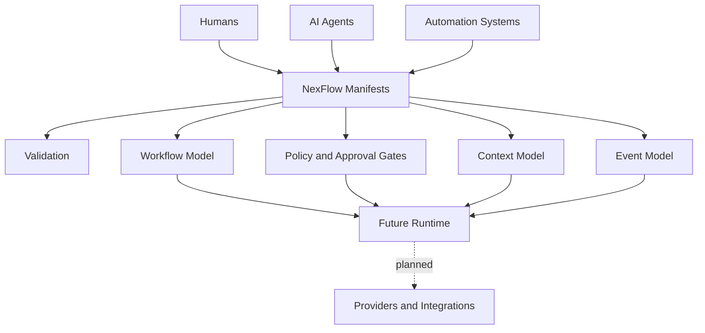

# NexFlow


**Open specification and orchestration framework for AI developer teams.**

NexFlow is a specification-first project for describing how humans, AI agents, automation systems, tools, context sources, approvals, and workflows cooperate on software projects.

It is **not** an AI coding agent, an LLM API wrapper, a chat application, or a personal productivity tool. The specification is the product. Runtimes, CLIs, and orchestration engines are future work.

## Status

Current release: **`v0.1.0`**, the first published foundation release of the
pre-`1.0` draft specification. Manifest `specVersion` remains `"0.1"`.

The [`v0.1.0` release scope](docs/0.1-scope.md) remains frozen as the evaluated
foundation baseline. It defines the baseline, optional and migration-only
surfaces, and deferred work. The exact commit, evaluated readiness record,
check output, and cross-surface review are published with the
[`v0.1.0` release](https://github.com/iwizy/NexFlow/releases/tag/v0.1.0).

Current development is focused on the planned **`0.2` validation and
conformance track**. Work on this track is unreleased and does not publish a new
manifest `specVersion`, select a runtime, or widen implementation claims. See
the [Unreleased changelog](CHANGELOG.md#unreleased) for the repository delta
after `v0.1.0`.

| Surface | Current State | Evidence |
| --- | --- | --- |
| Specification | Specified in draft form | [Documentation](docs/index.md), [Manifest Reference](docs/manifest-reference.md) |
| JSON Schemas | Implemented for 17 manifest kinds plus common definitions | [Schemas](schemas/), [Schema Guide](schemas/README.md) |
| Reference examples | Implemented as two compact learning examples and 6 complete project sets containing 109 schema-backed manifests | [Examples](examples/), [Examples Guide](examples/README.md) |
| Structural validation | Unified Node-based repository validation is implemented for schema and YAML syntax, manifest discovery and kind coverage, schema compilation, and all maintained examples; focused negative and model-boundary checks remain separate | `npm run validate`, `npm run negative-schema-fixtures`, [Validation](docs/validation.md) |
| Core Profile | Implemented for minimum Project and participant slots, optional module qualifiers, dependency closure, and fail-closed omission | `npm run core-profile-smoke`, [Core Profile](docs/core-profile.md), [Profile Definition](profiles/core.yaml) |
| Manifest discovery | Implemented for explicit local files, Project source hints, bounded Project filename selection, conservative cardinality, and multiple unique workflows | `npm run manifest-discovery-smoke`, [Manifest Discovery](docs/manifest-discovery.md) |
| Typed reference primitives | Implemented for shared structural shapes and lexical boundaries | `npm run typed-reference-schema-smoke`, [Typed References](docs/typed-references.md) |
| Approval gate targets | Implemented as closed typed target kinds with exact semantic resolution | `npm run approval-gate-target-schema-smoke`, [Approval Gate Targets](docs/approval-gate-targets.md) |
| Work reference namespaces | Implemented for workflow-scoped steps and assembly-scoped task artifacts | `npm run work-reference-namespace-smoke`, [Work Reference Namespaces](docs/work-reference-namespaces.md) |
| Provider feature vocabulary | Implemented as closed model support signals separate from action capabilities | `npm run provider-feature-schema-smoke`, [Provider Features](docs/provider-features.md) |
| Provider constraint vocabulary | Implemented as structured candidate eligibility fields with legacy migration | `npm run provider-constraint-schema-smoke`, [Provider Constraints](docs/provider-constraints.md) |
| MCP extension draft | Implemented as an offline policy profile and focused schema checks; no live integration | `npm run mcp-extension-smoke`, [MCP Extension Draft](extensions/mcp/README.md) |
| A2A extension draft | Implemented as an offline external-agent/task/artifact policy profile; no live integration | `npm run a2a-extension-smoke`, [A2A Extension Draft](extensions/a2a/README.md), [MCP And A2A Boundaries](docs/mcp-a2a-boundaries.md) |
| Event interoperability | Specified as CloudEvents and OpenTelemetry EventRecord mappings; no exporter or transport | [Event Interoperability](docs/event-interoperability.md), [Event Model](docs/events.md) |
| Conformance claim format | Implemented as standalone schema plus profile-qualified YAML and Markdown templates | `npm run conformance-claim-smoke`, [Conformance Claims](docs/conformance-claims.md) |
| Candidate readiness record | Implemented as a standalone eight-gate schema and non-claiming `0.1` template; evaluated release evidence is published for `v0.1.0` | `npm run candidate-readiness-smoke`, [0.1 Readiness Checklist](docs/readiness-checklist.md), [Release Evidence](release/README.md) |
| Current development line | Unreleased `0.2` validation and conformance hardening; no `0.2` release, new manifest `specVersion`, or runtime implementation | [Unreleased Changelog](CHANGELOG.md#unreleased), [Roadmap](docs/roadmap.md) |
| Semantic reference checks | Partial repository smoke coverage | `npm run semantic-smoke`, [Validation](docs/validation.md) |
| Governance and RFC process | Implemented in documentation | [Governance](docs/governance.md), [RFCs](rfcs/README.md) |
| Foundational model changes | ActorSet, compact AgentSet, and authoritative unique-active-definition slices implemented; RFCs remain Draft | [Actor Model](docs/actor-model.md), [Effective Agent Configuration](docs/effective-agent-configuration.md), [Foundational Model Review](rfcs/reviews/2026-07-foundational-model-review.md) |
| Human override policy | Structured fail-closed manifest model implemented; runtime enforcement absent | [Human Override](docs/human-override.md), [RFC-0017](rfcs/RFC-0017-human-override.md) |
| Credential handling policy | Structured fail-closed manifest model and focused checks implemented; credential broker, values, and runtime mediation absent | `npm run credential-handling-schema-smoke`, [Credential Handling](docs/credential-handling.md) |
| Runtime architecture decision | Review framework published; current outcome is `not-ready`, with no language or package layout selected | [Runtime Architecture Decision Review](rfcs/reviews/runtime-architecture-decision-review.md), [Runtime Options](docs/runtime-options.md), [Roadmap](docs/roadmap.md) |
| Reference CLI | Validation-only boundary specified; not implemented | [CLI And Runtime Responsibility Boundary](docs/cli-runtime-boundary.md), [RFC-0011](rfcs/RFC-0011-reference-cli-scope.md) |
| Repository CLI prototype | Experimental local discovery, JSON Schema validation, declared inspection, static graphing, and versioned JSON output; not a reference CLI alpha, language decision, or `NF-CLI` claim | `npm run cli-prototype -- --help`, [Prototype Scope](docs/cli-prototype.md), [JSON Diagnostics](docs/cli-diagnostics.md), [Declared Inspection](docs/cli-inspection.md), [Static Graph](docs/cli-graph.md) |
| Runtime and provider execution | Planned, not implemented | [Architecture](docs/architecture.md), [Runtime Options](docs/runtime-options.md) |
| Live integrations and extension loading | Not implemented | [Compatibility Matrix](docs/compatibility-matrix.md) |

Today, NexFlow can be used to author and review declarative team manifests,
validate the maintained examples structurally, and run limited cross-manifest
reference checks. It cannot execute tasks, call model providers, enforce policy,
load extensions, or orchestrate workflows.

The architecture review has not selected an implementation. The next runtime
milestone is to close the published decision blockers with comparable,
revision-pinned evidence and record an explicit review outcome. CLI and runtime
implementation remain blocked while the outcome is `not-ready`.

A disposable repository CLI prototype exercises local discovery and structural
validation using existing maintenance dependencies. Try
`npm run cli-prototype -- validate --root examples/minimal-team` to check a
selected assembly. It is not an accepted architecture candidate or a released
`nexflow` command; `npm run validate` remains the repository-wide schema and
example check. Neither command performs full semantic validation.

To see declarations and selected references, run
`node scripts/cli-prototype.mjs inspect --root examples/minimal-team`.
This [declared-only view](docs/cli-inspection.md) checks schemas first, but does
not resolve references, compute effective configuration, or expose prompt bodies.

To derive nodes and selected reference edges from the same bounded inventory,
run `node scripts/cli-prototype.mjs graph --root examples/minimal-team`. The
[static graph](docs/cli-graph.md) labels unresolved and ambiguous targets but
does not infer execution order, runtime state, or authority.

For machine consumers, use
`node scripts/cli-prototype.mjs validate --root examples/minimal-team --format json`.
The [experimental JSON contract](docs/cli-diagnostics.md) reports codes, safe
locations, check states, and failure status without executing manifests.

See the [Compatibility Matrix](docs/compatibility-matrix.md) for the exact tested
artifact pairing and the [0.1 Readiness Checklist](docs/readiness-checklist.md)
for the evidence criteria used to publish `v0.1.0`. `Specified`, `Partial`, and
`Implemented` are distinct support claims; documented future behavior is not an
implementation claim.

## Repository History Note

This repository was recreated on June 23, 2026 after personal files were accidentally committed during early bootstrapping.

The repository history was sanitized and republished with original commit author dates preserved where possible. Old pull request links from the previous repository instance should be considered obsolete.

No project specification content was intentionally removed as part of this cleanup.

## Problem

Software teams increasingly include humans, AI agents, CI systems, external tools, and automation services. Today, every tool describes agents, prompts, skills, memory, permissions, context, tasks, and workflow state differently.

That fragmentation makes it difficult to:

- audit what an agent is allowed to do
- understand which context sources are available
- coordinate work across tools
- hand work from one actor to another
- enforce approval gates
- preserve human authority
- compare or migrate between providers and runtimes

## Solution

NexFlow defines a common declarative layer for AI developer teams:

- **Team Structure as Code** for typed human, agent, automation, service, and authority identities, roles, responsibilities, and skills
- **Agent Definition as Code** for authoritative versioned behavior requests assembled from models, prompts, retrieval, permissions, memory, autonomy, and extensions
- **Workflow as Code** for tasks, dependencies, handoffs, and approvals
- **Context as Code** for repositories, docs, issue trackers, design systems, and knowledge bases
- **Permission as Code** for capabilities, access, and dangerous actions
- **Human Control as Code** for fail-closed pause, stop, revocation, and approval-gated resume
- **Memory as Code** for retention, ownership, visibility, and allowed consumers
- **Model Profile as Code** for provider-neutral model selection, constraints, fallback, and audit expectations
- **Prompt Set as Code** for prompt revisions, source references, ownership, safety review, and compatibility impact
- **Retrieval Profile as Code** for context sources, index versions, chunking, freshness, citations, and audit expectations
- **Integration as Code** for provider-neutral extensions

The goal is to make AI-assisted software delivery inspectable before anything runs.

## Core Concepts

- **Core Profile**: the minimum Project and participant assembly, with optional modules that become required when claimed or referenced.
- **Project**: the repository, product, or workstream governed by NexFlow manifests.
- **Team**: humans, agents, automation systems, and review authorities.
- **Actor**: a first-class human, agent, automation, service, or authority identity participating in project work.
- **Agent**: a stable AI identity with a role, responsibilities, and skills; versioned behavior belongs to agent definitions.
- **Agent Assembly**: the read-only inspection projection of an Effective Agent Configuration, including selected behavior, constraints, provenance, and blockers.
- **Agent Definition**: a versioned behavioral release; the unique unscoped active definition is authoritative for requested behavior but grants no access.
- **Capability**: something an actor can technically do, such as `read_repository` or `create_pull_request`.
- **Permission**: a policy rule with an `allow`, `deny`, or `approval_required` effect for capabilities.
- **Human Override**: a fail-closed project policy for human-controlled pause, stop, cancellation, blocking, revocation, and approval-gated resume.
- **Credential Reference**: a non-secret project-local requirement handle that a future runtime may bind through an external broker after independent authorization.
- **Context Source**: a repository, docs system, issue tracker, design file, web source, MCP server, or custom data source.
- **Memory Scope**: a declared retention and visibility boundary for remembered information.
- **Model Profile**: a provider-neutral model selection profile with pinned, floating, or policy-based selection and audit expectations.
- **Provider Feature**: a model support signal that is separate from project action capabilities and permissions.
- **Provider Constraint**: a provider-side eligibility fact or policy boundary
  that must be intersected with model-profile requirements and project policy.
- **Provider Adapter**: a future bounded translator for one host-selected and
  authorized provider invocation; it does not own selection, fallback, or tool
  execution.
- **Prompt Set**: versioned prompt material with source references, revisions, safety review, compatibility impact, and audit expectations.
- **Retrieval Profile**: versioned retrieval expectations for context sources, indexes, chunking, freshness, citations, sensitivity, and audit.
- **Workflow**: an ordered or event-driven set of tasks, dependencies, gates, and handoffs.
- **Handoff**: a structured transfer of responsibility between actors.
- **Event**: an auditable state transition such as `task.completed` or `review.requested`.
- **Audit Record**: an event instance accepted for durable review under an
  explicit storage policy; persistence does not authorize the recorded action.
- **Extension**: a namespaced integration surface for tools and protocols such as GitHub, Linear, Figma, Slack, MCP, A2A, or custom systems.

The experimental [`io.nexflow.mcp`](extensions/mcp/README.md) and
[`io.nexflow.a2a`](extensions/a2a/README.md) profiles specify policy boundaries
only. No MCP or A2A client, server, protocol binding, or live integration is
implemented. See [MCP And A2A Boundaries](docs/mcp-a2a-boundaries.md).

See [Concepts](docs/concepts.md) for the full domain model and [Glossary](docs/glossary.md) for quick terminology reference.

## Manifest Example

```yaml
specVersion: "0.1"
kind: ActorSet
metadata:
  project: nexflow-example
actors:
  - id: human-maintainer
    kind: human
    displayName: Human Maintainer
    description: Final human authority for accepted project changes.
    roles:
      - maintainer
    responsibilities:
      - Review proposed changes.
  - id: docs-architect
    kind: agent
    displayName: Documentation Architect
    description: AI participant that maintains specification clarity.
    roles:
      - technical_writer
    responsibilities:
      - Keep docs, schemas, and examples aligned.
      - Flag behavior that is not represented in the specification.
    skills:
      - specification_writing
      - schema_review
    agentRef:
      kind: agent
      id: docs-architect
```

## Architecture


```mermaid
flowchart TD
  H["Humans"] --> M["NexFlow Manifests"]
  A["AI Agents"] --> M
  CI["Automation Systems"] --> M
  M --> V["Validation"]
  M --> P["Policy and Approval Gates"]
  M --> C["Context Model"]
  M --> W["Workflow Model"]
  M --> E["Event Model"]
  W --> R["Future Runtime"]
  P --> R
  C --> R
  E --> R
  R -. planned .-> X["Providers and Integrations"]
```

NexFlow is intentionally split into layers:

1. **Specification**: stable language-independent model and manifest semantics.
2. **Schemas**: practical JSON Schemas for validation.
3. **Examples**: reference teams and workflows.
4. **Runtime**: future implementation that interprets the manifests.
5. **Products**: possible future desktop, cloud, and hosted orchestration layers.

## Repository Map

- [Documentation Index](docs/index.md): specification documentation and reading paths
- [profiles/](profiles/): machine-readable authoring profile definitions
- [extensions/](extensions/): maintained versioned extension policy profiles
- [schemas/](schemas/): draft JSON Schemas for core manifests
- [Schema Guide](schemas/README.md): schema scope, update rules, and validation boundaries
- [examples/](examples/): complete reference team configurations
- [Examples Guide](examples/README.md): overview of reference teams and manifest file sets
- [conformance/](conformance/): standalone conformance claim schema and publication templates
- [release/](release/): standalone candidate readiness schema, template, and release evidence guidance
- [Fixtures Guide](fixtures/README.md): focused validation inputs, expected outcomes, and maintenance rules
- [fixtures/discovery/](fixtures/discovery/): focused logical assembly and multiple-workflow validation evidence
- [fixtures/schema/invalid/](fixtures/schema/invalid/): intentionally invalid
  manifests for stable schema rejection checks
- [rfcs/](rfcs/README.md): governance and design proposal process
- [Foundational Model Review](rfcs/reviews/2026-07-foundational-model-review.md): compatibility, safety, blockers, and implementation order for RFC-0013 through RFC-0016
- [Conformance](docs/conformance.md): draft support levels for manifests, validators, CLIs, runtimes, and extensions
- [Compatibility Matrix](docs/compatibility-matrix.md): current support and explicit implementation gaps
- [Validation](docs/validation.md): repository checks and their boundaries
- [Manifest Discovery](docs/manifest-discovery.md): explicit source boundaries, logical inventory, cardinality, and multiple-workflow rules
- [Semantic Reference Inventory](docs/semantic-reference-inventory.md): prioritized cross-manifest reference contracts and current coverage
- [Typed References](docs/typed-references.md): shared reference shapes, lexical rules, field contracts, and migration guidance
- [Approval Gate Targets](docs/approval-gate-targets.md): typed gate targets, exact namespaces, workflow scope, and legacy migration
- [Work Reference Namespaces](docs/work-reference-namespaces.md): deterministic workflow step and task artifact identity
- [Event Interoperability](docs/event-interoperability.md): CloudEvents and OpenTelemetry mappings without transport or storage commitments
- [Provider Features](docs/provider-features.md): closed provider support vocabulary and capability separation
- [Provider Constraints](docs/provider-constraints.md): structured provider eligibility, composition, migration, and validation boundaries
- [MCP Extension Draft](extensions/mcp/README.md): experimental MCP context/action policy mapping without runtime behavior
- [A2A Extension Draft](extensions/a2a/README.md): experimental remote-agent, task, and artifact policy mapping without runtime behavior
- [MCP And A2A Boundaries](docs/mcp-a2a-boundaries.md): protocol ownership, identity, authority, work, artifact, network, and audit boundaries
- [Actor Model](docs/actor-model.md): first-class participant identity and kind-specific relationships
- [Actor Model Migration](docs/actor-model-migration.md): staged transition from mixed AgentSet identity
- [Agent Identity Migration](docs/agent-identity-migration.md): transition from duplicated AgentSet behavior fields to compact stable identity
- [Effective Agent Configuration](docs/effective-agent-configuration.md): authoritative active-definition selection, policy boundaries, migration, and validation
- [Human Override](docs/human-override.md): fail-closed human-control policy, resume gate, and audit contract
- [Credential Handling](docs/credential-handling.md): external-only references, operation-scoped mediation, failure, redaction, and audit rules
- [Network Access Policy](docs/network-access-policy.md): fail-closed outbound connection rules and migration from advisory strings
- [Release Plan](docs/release-plan.md): public readiness criteria from `0.1` draft through `1.0`
- [0.1 Readiness Checklist](docs/readiness-checklist.md): candidate gates, evidence rules, decision outcomes, and release blockers
- [CONTRIBUTING.md](CONTRIBUTING.md): contribution workflow
- [Maintainer Guide](docs/maintainer-guide.md): review, synchronization,
  validation, merge, RFC, release, and handoff workflow
- [SECURITY.md](SECURITY.md): vulnerability and safety reporting policy

## Specification Guide

| Need | Start Here |
| --- | --- |
| Understand the vocabulary | [Concepts](docs/concepts.md), [Glossary](docs/glossary.md) |
| Onboard with the smallest useful project | [Minimal Team](examples/minimal-team/), [Core Profile](docs/core-profile.md) |
| Start with the minimum project shape | [Core Profile](docs/core-profile.md), [Manifest Reference](docs/manifest-reference.md) |
| Discover one logical project assembly | [Manifest Discovery](docs/manifest-discovery.md), [Core Profile](docs/core-profile.md), [Validation](docs/validation.md) |
| Model participant identity | [Actor Model](docs/actor-model.md), [Actor Model Migration](docs/actor-model-migration.md) |
| Model resource references | [Typed References](docs/typed-references.md), [Approval Gate Targets](docs/approval-gate-targets.md), [Work Reference Namespaces](docs/work-reference-namespaces.md), [Semantic Reference Inventory](docs/semantic-reference-inventory.md), [Manifest Reference](docs/manifest-reference.md) |
| See every manifest shape | [Manifest Reference](docs/manifest-reference.md) |
| Understand safety boundaries | [Security Model](docs/security-model.md), [Human Override](docs/human-override.md), [Credential Handling](docs/credential-handling.md), [Network Access Policy](docs/network-access-policy.md), [Approval Gates](docs/approval-gates.md) |
| Version and select agent behavior | [Effective Agent Configuration](docs/effective-agent-configuration.md), [Agent Assembly](docs/agent-assembly.md), [Agent Definitions](docs/agent-definitions.md), [Versioning](docs/versioning.md), [Event Model](docs/events.md) |
| Model what agents can and may do | [Capability Model](docs/capability-model.md), [Autonomy Model](docs/autonomy-model.md) |
| Model what agents may know or retain | [Context Model](docs/context-model.md), [Memory Model](docs/memory-model.md) |
| Model provider-neutral model selection | [Model Profiles](docs/model-profiles.md), [Provider Abstraction](docs/provider-abstraction.md), [Provider Features](docs/provider-features.md), [Provider Constraints](docs/provider-constraints.md), [Provider Adapter Boundary](docs/provider-adapter-boundary.md), [Versioning](docs/versioning.md) |
| Model prompt revisions and safety review | [Prompt Sets](docs/prompt-sets.md), [Versioning](docs/versioning.md), [Event Model](docs/events.md) |
| Model retrieval, freshness, and citations | [Retrieval Profiles](docs/retrieval-profiles.md), [Context Model](docs/context-model.md), [Event Model](docs/events.md) |
| Model event evidence and audit storage | [Event Model](docs/events.md), [Event And Audit Storage Boundary](docs/event-audit-storage-boundary.md), [Event Interoperability](docs/event-interoperability.md), [Conformance](docs/conformance.md) |
| Separate validation tooling from runtime execution | [CLI And Runtime Responsibility Boundary](docs/cli-runtime-boundary.md), [Validation](docs/validation.md), [Runtime Options](docs/runtime-options.md), [Conformance](docs/conformance.md) |
| Validate manifests | [Validation](docs/validation.md), [Diagnostic Code Catalog](docs/diagnostic-code-catalog.md), [Semantic Reference Inventory](docs/semantic-reference-inventory.md), [Schema Guide](schemas/README.md), [Conformance](docs/conformance.md), [Compatibility Matrix](docs/compatibility-matrix.md) |
| Publish a support claim | [Conformance Claims](docs/conformance-claims.md), [Claim Templates](conformance/README.md), [Compatibility Matrix](docs/compatibility-matrix.md) |
| Extend or integrate NexFlow | [Extension Profiles](extensions/README.md), [Extension Model](docs/extensions.md), [Extension Loading Boundary](docs/extension-loading-boundary.md), [MCP And A2A Boundaries](docs/mcp-a2a-boundaries.md), [MCP Extension Draft](extensions/mcp/README.md), [A2A Extension Draft](extensions/a2a/README.md), [Integrations](docs/integrations.md), [Provider Abstraction](docs/provider-abstraction.md) |
| Review the `v0.1.0` release boundary and evidence | [0.1 Candidate Scope](docs/0.1-scope.md), [0.1 Readiness Checklist](docs/readiness-checklist.md), [Compatibility Matrix](docs/compatibility-matrix.md) |
| Review future implementation choices | [Runtime Options](docs/runtime-options.md), [Runtime Language Evaluation Matrix](docs/language-evaluation-matrix.md), [Runtime Architecture Decision Review](rfcs/reviews/runtime-architecture-decision-review.md), [Roadmap](docs/roadmap.md), [Release Plan](docs/release-plan.md) |

## Roadmap

The current priorities are:

1. Review `v0.1.0` feedback and continue the `0.2` validation and conformance
   work without widening runtime claims.
2. Review the ActorSet, compact AgentSet, active-definition authority, human
   override, Agent Assembly inspection, and typed-reference primitive slices
   before broader field or example migration.
3. Add positive fixtures, expand maintained negative fixtures, stabilize
   diagnostics, and broaden semantic checks.
4. Close the Runtime Architecture Decision blockers: publish the proposal,
   complete package, threat, credential, and conformance inputs, and produce
   comparable candidate evidence using the
   [Runtime Language Evaluation Matrix](docs/language-evaluation-matrix.md).
5. Record an explicit outcome under the mandatory
   [Runtime Architecture Decision Review](rfcs/reviews/runtime-architecture-decision-review.md);
   no language or implementation is selected while the outcome is `not-ready`.
6. After an accepted decision, build a validation-focused reference CLI for
   `init`, `validate`, `inspect`,
   and `graph`; it must not orchestrate work.
7. Explore a runtime prototype only after its permission, approval, credential,
   network, extension, and audit boundaries are specified.

See [Roadmap](docs/roadmap.md), [Release Plan](docs/release-plan.md),
[0.1 Candidate Scope](docs/0.1-scope.md),
[0.1 Readiness Checklist](docs/readiness-checklist.md), and the
[Foundational Model Review](rfcs/reviews/2026-07-foundational-model-review.md).

## Governance Summary

NexFlow uses an RFC process for material changes. Breaking changes require migration notes, compatibility impact, and review by maintainers. Runtime implementations must not introduce behavior that is absent from the specification.

See [Governance](docs/governance.md) and [RFCs](rfcs/README.md).

## Known Limitations

- `specVersion: "0.1"` is pre-`1.0`; fields and semantics may change with
  documented compatibility and migration guidance.
- The current schemas validate useful structure, not complete cross-manifest
  meaning, policy correctness, graph safety, or runtime enforceability.
- Semantic reference checks cover selected repository invariants only and do not
  establish full `NF-SEMANTIC` conformance.
- Minimal Team intentionally stops at Project, ActorSet, and compact AgentSet.
  Active-definition authority is demonstrated by focused checks and
  documentation; the six complete examples retain draft definitions and cannot
  produce a normal selected effective configuration.
- Six maintained examples use the legacy 16-manifest participant inventory;
  Minimal Team is the reduced maintained ActorSet migration and Core Profile
  onboarding path.
- Discovery is limited to explicit local files and Project source hints;
  directory scans, general indexes, bundles, remote sources, workflow selection,
  and runtime loading are not implemented.
- Schemas are not yet distributed as an independently versioned package. Use a
  repository release, tag, or commit to identify a reproducible schema snapshot.
- Draft RFCs may describe behavior that has not yet been incorporated into the
  manifest reference, schemas, examples, or compatibility contract.
- No reference CLI, runtime engine, provider adapter, extension loader, live
  integration, task execution, workflow orchestration, or deployment support
  exists.
- MCP and A2A profiles are offline policy maps. They do not discover endpoints,
  negotiate protocol versions, authenticate, invoke tools or remote agents,
  synchronize task state, import artifacts, stream, or receive callbacks.
- Security and approval requirements constrain future implementations, but this
  repository does not enforce them at runtime.
- Human override manifests describe required pause, stop, revocation, resume,
  and audit behavior but do not interrupt processes or authenticate people.

## FAQ

**Is NexFlow an agent?**  
No. NexFlow describes agents and workflows.

**Does NexFlow call LLM providers?**  
No. Provider abstraction is specified, but no provider integration is implemented.

**Can this work without a runtime?**  
Yes. Teams can use NexFlow manifests as auditable documentation, planning artifacts, and reviewable policy.

**Why YAML?**  
YAML is readable in repositories and familiar to software teams. JSON compatibility is preserved through schemas.

**Which license does NexFlow use?**  
MIT during the current specification-first phase. The project has documented
the Apache-2.0 patent tradeoff and the events that require a future license
review in [Licensing And Patent Rationale](docs/licensing-and-patent-rationale.md).

## Contributing

Start with [CONTRIBUTING.md](CONTRIBUTING.md). Maintainers should also follow
the [Maintainer Guide](docs/maintainer-guide.md). Changes that alter the model,
manifests, schemas, or compatibility expectations should go through the RFC
process.

## License

NexFlow is licensed under the [MIT License](LICENSE). See
[Licensing And Patent Rationale](docs/licensing-and-patent-rationale.md) for the
current decision and mandatory review triggers.
