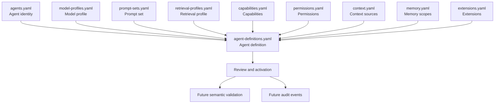

# Agent Assembly

Agent assembly is the draft NexFlow vocabulary for the cross-manifest relationship and review checkpoint around an AI developer agent's behavioral configuration.

It links an agent identity to an agent definition and the model, prompt, retrieval, permission, context, memory, autonomy, and extension references that shape how that agent is expected to behave.

Agent assembly is not a separate manifest kind or another behavioral version. It is specification metadata and does not run agents, call providers, render prompts, retrieve context, write memory, enforce permissions, or execute workflows.

Related RFCs: [RFC-0004: Agent Definition Versioning](../rfcs/RFC-0004-agent-definition-versioning.md) and [RFC-0014: Effective Agent Configuration](../rfcs/RFC-0014-effective-agent-configuration.md).

## Purpose

NexFlow separates a stable agent identity from the components that may change over time.

An agent identity answers:

- who the agent is
- what role it serves
- what responsibilities it has
- what skills, capabilities, permissions, context, memory, autonomy, and extensions are declared for it

An agent assembly answers:

- which versioned behavioral definition is proposed or active
- which model profile should be used or resolved
- which prompt set and prompt revisions shape behavior
- which retrieval profile describes context selection and evidence expectations
- which permissions, capabilities, context sources, memory scopes, autonomy level, and extensions are part of the reviewed release
- which review, activation, compatibility, and audit expectations apply

This gives humans a way to review behavior-changing agent updates without treating every manifest field as a runtime implementation detail.

## Assembly Components

| Component | Question it answers |
| --- | --- |
| Agent identity | Which team participant is being described? |
| Agent definition | Which reviewed behavioral release is proposed or active? |
| Model profile | Which provider-neutral model selection expectations apply? |
| Prompt set | Which prompt revisions, source references, and safety review state apply? |
| Retrieval profile | Which context sources, index versions, freshness rules, citations, and sensitivity boundaries apply? |
| Capabilities | What technical actions might this release need? |
| Permissions | Which rules have `allow`, `deny`, or `approval_required` effects? |
| Context sources | What declared information sources are in scope? |
| Memory scopes | What retention, ownership, visibility, and reuse boundaries apply? |
| Autonomy level | How independently may the agent act? |
| Extensions | Which namespaced integration surfaces may affect tools, context, or events? |

## Reference Rules

Component references do not grant access by themselves.

A future runtime or validator should treat an agent assembly as a set of claims to check against the rest of the project:

- referenced agents, profiles, permissions, capabilities, context sources, memory scopes, and extensions exist
- model profile constraints are compatible with project policy
- prompt set review state is compatible with the agent's autonomy and capabilities
- retrieval profile sources are compatible with declared context access and sensitivity limits
- high-risk capabilities remain denied or approval-gated unless explicitly approved
- autonomy level is compatible with permissions, approval gates, and project policy
- audit settings can record the definition, component references, review state, and resolved runtime choices when available

These checks are semantic validation. JSON Schemas can validate shape, but they cannot prove that cross-manifest references, safety intent, or runtime policies are coherent.

## Versioning

Agent assembly uses multiple version layers:

| Version | Meaning |
| --- | --- |
| Manifest `specVersion` | The NexFlow manifest shape, such as `0.1`. |
| Agent definition `definitionVersion` | A behaviorally meaningful agent release. |
| Model profile metadata | Model selection expectations, pinned model references, floating aliases, constraints, and fallback rules. |
| Prompt set `version` and prompt `revision` | Prompt material and safety review state. |
| Retrieval profile `version` | Context retrieval, freshness, citation, and sensitivity expectations. |
| Extension version metadata | Integration surface compatibility when an extension defines its own lifecycle. |

Agent assembly has no separate version field. It is a review checkpoint over the identity, agent definition, component versions, and policy references listed above.

Changing an agent assembly component can be behavior-changing even when the manifest `specVersion` stays the same.

The current checkpoint keeps `specVersion: "0.1"`. The agent assembly vocabulary is still draft and should not be treated as a stable runtime contract.

## Review Checklist

Before activating or publishing an agent definition, reviewers should ask:

- Does the `agentRef` point to a declared agent identity?
- Are the referenced model, prompt, and retrieval profiles present and reviewed?
- Do prompt changes alter safety, output style, required evidence, or tool-use guidance?
- Do retrieval changes broaden context scope, classification, freshness tolerance, or cross-scope reuse?
- Are high-risk capabilities explicitly denied or approval-gated?
- Is autonomy compatible with the declared permissions and approval gates?
- Are memory scopes appropriate for the task and sensitivity of expected data?
- Do extension references stay inside declared namespace and permission boundaries?
- Do audit expectations identify enough metadata to explain future agent actions?
- Are compatibility notes present for behavior-changing updates?

## Relationship To Runtime

Agent assembly is designed so future runtimes can resolve and enforce it, but no runtime exists in this repository.

A future runtime may:

- load agent definitions
- resolve component references
- check semantic compatibility
- require approval before activation
- record model, prompt, retrieval, permission, memory, and autonomy metadata in events
- reject unsafe or incomplete assemblies

Those behaviors are planned runtime responsibilities. This repository currently provides documentation, schemas, examples, and RFCs only.

## Current Status

Agent assembly is draft specification vocabulary in NexFlow `0.1`.

The current draft covers:

- agent definition versioning
- model profile versioning
- prompt set versioning
- retrieval profile versioning
- examples that show the components together
- audit expectations for future events
- compatibility guidance for behavior-changing component updates

Future work should focus on semantic validation strategy, conformance expectations, examples, and review feedback before any runtime implementation begins.
