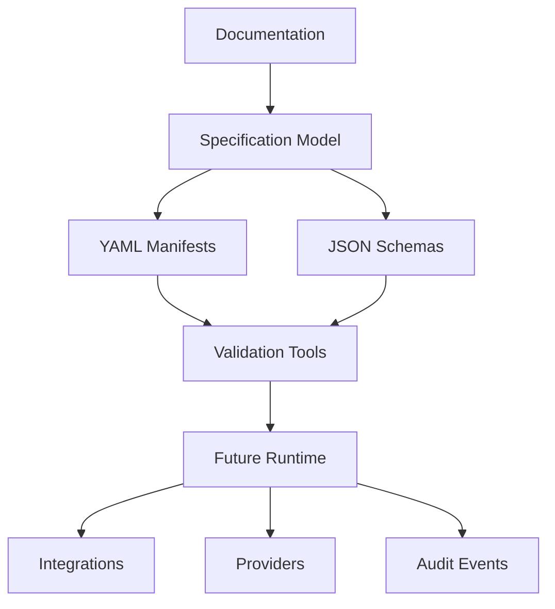

# Architecture

NexFlow separates specification, validation, and execution.

## Layered Model

## Repository Architecture

- `docs/` defines intended semantics.
- `schemas/` provides practical validation.
- `examples/` demonstrates coherent configurations.
- `rfcs/` records design proposals and accepted decisions.

## Runtime Boundary

The runtime is future work. A conforming runtime is expected to:

- load manifests
- validate versions and schemas
- resolve references
- enforce permissions and approval gates
- emit auditable events
- respect context and memory boundaries
- integrate with providers through abstractions

The current repository does not execute workflows.

## Provider Boundary

Providers are abstract. The specification may describe desired model traits, routing preferences, and constraints, but it must not require any specific vendor.

## Integration Boundary

Integrations are described through extension manifests and context sources. Integrations must not silently expand permissions. Access must be represented through capabilities, permissions, and approval gates.

## Audit Boundary

Every future runtime should be able to explain:

- which manifest authorized an action
- which actor initiated it
- which approval gate applied
- which context sources were used
- which memory scopes were read or written
- which event was emitted
