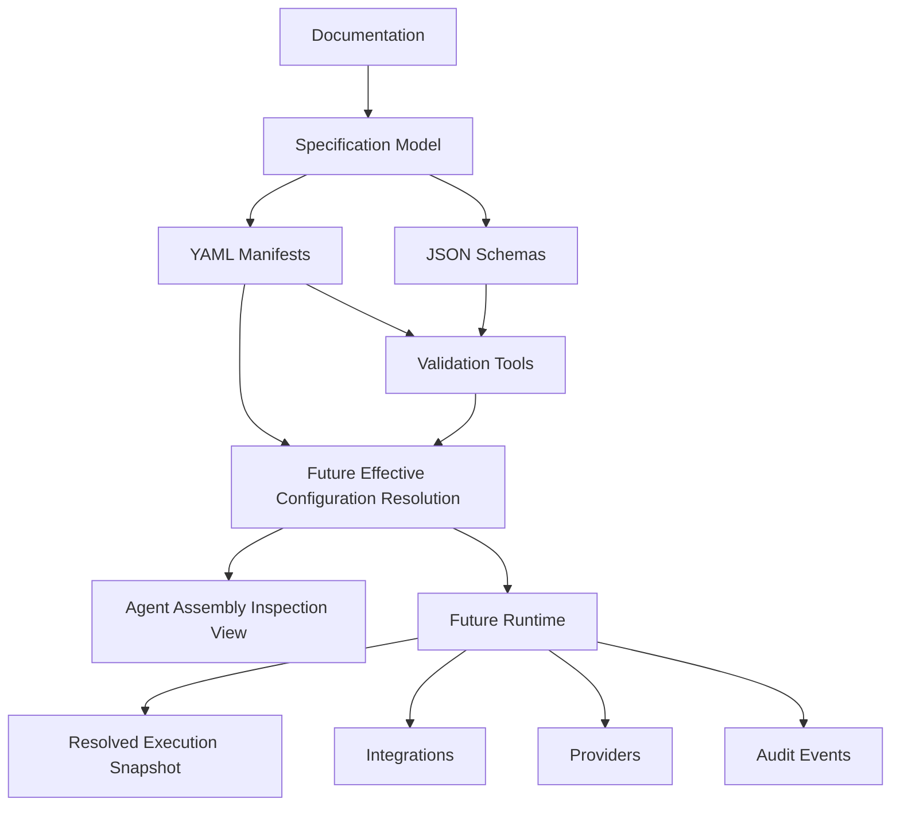

# Architecture

NexFlow separates specification, validation, and execution.

## Layered Model

```mermaid
flowchart TD
  D["Documentation"] --> S["Specification Model"]
  S --> M["YAML Manifests"]
  S --> J["JSON Schemas"]
  M --> V["Validation Tools"]
  J --> V
  M --> E["Future Effective Configuration Resolution"]
  V --> E
  E --> AS["Agent Assembly Inspection View"]
  E --> R["Future Runtime"]
  R --> RS["Resolved Execution Snapshot"]
  R --> I["Integrations"]
  R --> P["Providers"]
  R --> AE["Audit Events"]
```

## Repository Architecture

- `docs/` defines intended semantics.
- `profiles/` defines machine-readable authoring profile contracts.
- `extensions/` defines versioned non-core integration policy profiles.
- `schemas/` provides practical validation.
- `examples/` demonstrates coherent configurations.
- `rfcs/` records design proposals and accepted decisions.

## Logical Assembly

Manifests should be interpreted as one logical project assembly after deterministic discovery. Declared `specVersion`, `kind`, project identity, resource IDs, and references determine meaning; conventional file names remain authoring aids rather than semantic identity.

The [Core Profile](core-profile.md) implements the minimum Project and
participant contract, optional module qualifiers, dependency closure, and
fail-closed omission semantics from
[RFC-0016](../rfcs/RFC-0016-core-profile-and-discovery.md). General logical
discovery now has a focused validation implementation for explicit local files
and Project source hints, including multiple unique Workflow documents.
Directory scanning, separate source indexes, bundles, stable CLI diagnostics,
and runtime loading remain Draft. See
[Manifest Discovery](manifest-discovery.md).

## Actor Identity View

The optional `ActorSet` layer identifies human, agent, automation, service, and
authority participants before policy or behavior is resolved. When present, it
is the authoritative participant namespace for the assembly. An agent actor
uses an explicit typed reference to stable AI identity in `AgentSet`; agent
definitions and their components remain separate behavioral resources.
Migrated AgentSet entries retain only stable identity metadata; deprecated
behavior fields remain available for legacy compatibility.

For each stable AI identity, the unique unscoped active `AgentDefinitionSet`
entry is authoritative for requested behavior. Deprecated AgentSet behavior
fields are compatibility data, not merge inputs or constraints. Policy
manifests retain authority for permissions, capabilities, context, memory,
provider use, approvals, and human control.

Projects without `ActorSet` retain the documented legacy participant fallback
during the `0.1` migration window. See [Actor Model](actor-model.md) and
[Actor Model Migration](actor-model-migration.md).

Human override is a project policy layer above requested behavior and autonomy.
It may only narrow activity and does not become an execution or permission
source. See [Human Override](human-override.md).

## Agent Assembly View

Agent Assembly is the derived inspection projection of an Effective Agent
Configuration. It connects agent identity with versioned behavioral components:

- agent definitions
- model profiles
- prompt sets
- retrieval profiles
- permissions and capabilities
- context sources and memory scopes
- autonomy levels and extensions

It presents requested values, applicable constraints, provenance, unresolved
runtime facts, and blockers. It is read-only evidence, not a manifest,
behavioral declaration, grant, or runtime input. The current repository defines
this relationship in documentation but does not implement the resolver or view
serializer. See [Agent Assembly](agent-assembly.md) and
[Effective Agent Configuration](effective-agent-configuration.md).

## Reference CLI Boundary

The future reference CLI is an authoring, validation, inspection, and static
graph tool. Its initial commands operate offline on explicit local inputs. Only
`init` and explicitly requested output files may write within a visible local
destination; no validation command acquires credentials, loads executable
extensions, calls providers or integrations, starts processes, or performs
runtime preflight.

Pure parsing, schema, semantic, diagnostic, inventory, and graph libraries may
be shared with a runtime. Validation command selection must not initialize
runtime services or authority, and CLI success must not replace current runtime
preflight or operation authorization. See
[CLI And Runtime Responsibility Boundary](cli-runtime-boundary.md).

## Runtime Boundary

The runtime is future work. A conforming runtime is expected to:

- load manifests
- validate versions and schemas
- resolve references
- enforce permissions and approval gates
- emit auditable events
- respect context and memory boundaries
- integrate with providers through abstractions

The current repository does not execute workflows.

The future implementation language must be selected through the
[Runtime Language Evaluation Matrix](language-evaluation-matrix.md) and a
reviewed Runtime Architecture Decision. Existing JavaScript maintenance scripts
do not select TypeScript, Python, Rust, Go, or any other runtime language.

The decision is accepted only after it satisfies the
[Runtime Architecture Decision Review](../rfcs/reviews/runtime-architecture-decision-review.md),
including comparative evidence, CLI/runtime separation, security, packaging,
extension, provider, audit, conformance, compatibility, and ownership gates.
The current outcome is `not-ready`, so runtime implementation remains blocked.

## Provider Boundary

Providers are abstract. The specification may describe desired model traits, routing preferences, and constraints, but it must not require any specific vendor.

Provider features occupy a separate namespace from project action capabilities.
Feature support may narrow provider selection but cannot grant an actor an
action, permission, connection, credential, or tool.

Provider selection and provider invocation are separate runtime stages. The
host owns selection, constraints, permission, approval, context, memory,
network, credential, fallback, and human-override decisions. A future provider
adapter receives one authorized target, translates it without semantic
broadening, and returns a normalized result or failure. It cannot select hidden
fallback or execute model-requested tools. See
[Provider Adapter Boundary](provider-adapter-boundary.md).

## Integration Boundary

Integrations are described through extension manifests and context sources. Integrations must not silently expand permissions. Access must be represented through capabilities, permissions, and approval gates.

Project declaration discovery is separate from executable implementation
discovery. A future runtime must use an explicit runtime-owned implementation
catalog, select and verify one immutable artifact, fail closed for unsupported
or ambiguous behavior, isolate loaded code, and authorize each operation
independently. A namespace, profile, installed package, or successful load does
not grant authority. See
[Extension Loading Boundary](extension-loading-boundary.md).

MCP and A2A remain externally governed protocol layers. MCP resources, prompts,
and tools do not become NexFlow context authority, prompt authority, or action
grants automatically. A2A Agent Cards, agents, skills, messages, tasks, and
artifacts do not become local Actors, capabilities, Handoffs, TaskSet entries,
or artifacts automatically. See
[MCP And A2A Boundaries](mcp-a2a-boundaries.md).

## Audit Boundary

Every future runtime should be able to explain:

- which manifest authorized an action
- which actor initiated it
- which approval gate applied
- which context sources were used
- which memory scopes were read or written
- which event was emitted

CloudEvents and OpenTelemetry may carry derived event representations, but they
do not become the source of local state or authority. Event export must preserve
NexFlow identity, correlation, causation, redaction, and audit meaning without
turning `correlationId` into trace identity. Transport and telemetry storage are
future runtime concerns.

The host constructs event meaning and applies classification, minimization,
redaction, and policy before persistence or export. A future audit store may be
authoritative for a stated retention and completeness claim, but not for
permission, approval, workflow, memory, or human-override state. Runtime claims
must distinguish the designated audit store from queues, indexes, telemetry,
archives, and evidence stores, and must expose duplicates, gaps, partial writes,
ordering scope, retention, deletion, and integrity limitations. See
[Event And Audit Storage Boundary](event-audit-storage-boundary.md) and
[Event Interoperability](event-interoperability.md).
