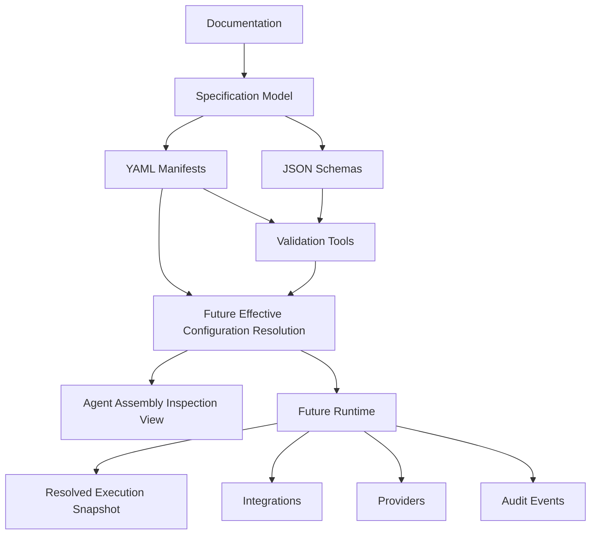

# Architecture

NexFlow separates specification, validation, and execution.

## Layered Model

```mermaid
flowchart TD
  D["Documentation"] --> S["Specification Model"]
  S --> M["YAML Manifests"]
  S --> J["JSON Schemas"]
  M --> V["Validation Tools"]
  J --> V
  M --> E["Future Effective Configuration Resolution"]
  V --> E
  E --> AS["Agent Assembly Inspection View"]
  E --> R["Future Runtime"]
  R --> RS["Resolved Execution Snapshot"]
  R --> I["Integrations"]
  R --> P["Providers"]
  R --> AE["Audit Events"]
```

## Repository Architecture

- `docs/` defines intended semantics.
- `profiles/` defines machine-readable authoring profile contracts.
- `extensions/` defines versioned non-core integration policy profiles.
- `schemas/` provides practical validation.
- `examples/` demonstrates coherent configurations.
- `rfcs/` records design proposals and accepted decisions.

## Logical Assembly

Manifests should be interpreted as one logical project assembly after deterministic discovery. Declared `specVersion`, `kind`, project identity, resource IDs, and references determine meaning; conventional file names remain authoring aids rather than semantic identity.

The [Core Profile](core-profile.md) implements the minimum Project and
participant contract, optional module qualifiers, dependency closure, and
fail-closed omission semantics from
[RFC-0016](../rfcs/RFC-0016-core-profile-and-discovery.md). General logical
discovery, multiple workflow loading, source indexes, and stable discovery
diagnostics remain Draft.

## Actor Identity View

The optional `ActorSet` layer identifies human, agent, automation, service, and
authority participants before policy or behavior is resolved. When present, it
is the authoritative participant namespace for the assembly. An agent actor
uses an explicit typed reference to stable AI identity in `AgentSet`; agent
definitions and their components remain separate behavioral resources.
Migrated AgentSet entries retain only stable identity metadata; deprecated
behavior fields remain available for legacy compatibility.

For each stable AI identity, the unique unscoped active `AgentDefinitionSet`
entry is authoritative for requested behavior. Deprecated AgentSet behavior
fields are compatibility data, not merge inputs or constraints. Policy
manifests retain authority for permissions, capabilities, context, memory,
provider use, approvals, and human control.

Projects without `ActorSet` retain the documented legacy participant fallback
during the `0.1` migration window. See [Actor Model](actor-model.md) and
[Actor Model Migration](actor-model-migration.md).

Human override is a project policy layer above requested behavior and autonomy.
It may only narrow activity and does not become an execution or permission
source. See [Human Override](human-override.md).

## Agent Assembly View

Agent Assembly is the derived inspection projection of an Effective Agent
Configuration. It connects agent identity with versioned behavioral components:

- agent definitions
- model profiles
- prompt sets
- retrieval profiles
- permissions and capabilities
- context sources and memory scopes
- autonomy levels and extensions

It presents requested values, applicable constraints, provenance, unresolved
runtime facts, and blockers. It is read-only evidence, not a manifest,
behavioral declaration, grant, or runtime input. The current repository defines
this relationship in documentation but does not implement the resolver or view
serializer. See [Agent Assembly](agent-assembly.md) and
[Effective Agent Configuration](effective-agent-configuration.md).

## Runtime Boundary

The runtime is future work. A conforming runtime is expected to:

- load manifests
- validate versions and schemas
- resolve references
- enforce permissions and approval gates
- emit auditable events
- respect context and memory boundaries
- integrate with providers through abstractions

The current repository does not execute workflows.

## Provider Boundary

Providers are abstract. The specification may describe desired model traits, routing preferences, and constraints, but it must not require any specific vendor.

Provider features occupy a separate namespace from project action capabilities.
Feature support may narrow provider selection but cannot grant an actor an
action, permission, connection, credential, or tool.

## Integration Boundary

Integrations are described through extension manifests and context sources. Integrations must not silently expand permissions. Access must be represented through capabilities, permissions, and approval gates.

## Audit Boundary

Every future runtime should be able to explain:

- which manifest authorized an action
- which actor initiated it
- which approval gate applied
- which context sources were used
- which memory scopes were read or written
- which event was emitted
