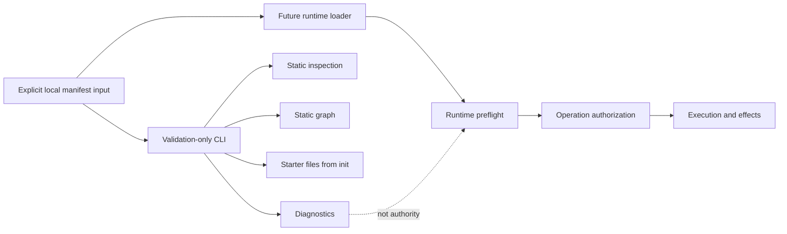

# CLI And Runtime Responsibility Boundary

NexFlow plans a validation-focused reference CLI before any orchestration
runtime. The CLI should help people author, validate, inspect, and visualize
manifests without acquiring the authority or ambient access needed to execute
them.

This document defines the boundary between that future CLI and a future
runtime. It is a language-neutral specification contract, not a command-line
implementation, package layout, plugin API, runtime API, or language decision.

Related documents:

- [Validation](validation.md)
- [Conformance](conformance.md)
- [Diagnostic Code Catalog](diagnostic-code-catalog.md)
- [Manifest Discovery](manifest-discovery.md)
- [Extension Loading Boundary](extension-loading-boundary.md)
- [Runtime Options](runtime-options.md)
- [Runtime Language Evaluation Matrix](language-evaluation-matrix.md)
- [RFC-0011: Reference CLI Scope](../rfcs/RFC-0011-reference-cli-scope.md)
- [RFC-0005: Validation Strategy](../rfcs/RFC-0005-validation-strategy.md)

## Goals

- make validation-only command responsibilities explicit before implementation
- distinguish syntax, schema, and static semantic checks from runtime preflight
  and enforcement
- define the allowed filesystem, process, network, credential, extension, and
  remote-system effects of each initial command
- keep static outputs deterministic, source-grounded, and non-authoritative
- permit safe reuse of pure specification libraries without importing runtime
  authority into the CLI
- require CLI and runtime support claims to remain separate even when one
  project, language, binary, or package family implements both

## Non-Goals

This document does not:

- implement `nexflow` or select TypeScript, Python, Rust, Go, or another
  language
- define final flags, output schemas, exit codes, installer behavior, or stable
  diagnostic codes
- authorize workflow execution, provider calls, context retrieval, memory
  persistence, tool invocation, deployment, or remote mutation
- define runtime scheduling, sandboxing, credential brokering, provider
  adapters, event storage, or extension execution
- require CLI and runtime code to live in the same repository, language,
  process, binary, or release
- make successful validation evidence that a project is executable, approved,
  safe, or supported by a runtime
- add fields to NexFlow manifests

## Responsibility Layers

NexFlow separates five layers that tools must name accurately:

| Layer | Purpose | Typical owner | Authority |
| --- | --- | --- | --- |
| Syntax validation | Parse local YAML and JSON-compatible data safely. | Validator library or CLI | None beyond reading selected input. |
| Schema validation | Check one manifest against the schema for its `kind` and `specVersion`. | Validator library or CLI | None; shape validity is not execution authority. |
| Static semantic validation | Resolve declared references and evaluate rules that depend only on the selected manifest assembly and pinned specification data. | Semantic validator or CLI | None; it reports compatibility and policy findings. |
| Runtime preflight | Determine whether one exact runtime deployment can support an intended execution with its installed components and current environment. | Runtime or explicitly runtime-scoped tool | May inspect runtime facts but does not itself authorize the effect. |
| Runtime enforcement | Execute or coordinate work while enforcing capabilities, permissions, approvals, autonomy, context, memory, providers, network, credentials, extensions, and audit. | Runtime | Operation-scoped authority after all policy checks. |

An initial `NF-CLI` claim covers only the first three layers and the bounded
authoring behavior of `init`. Runtime preflight and enforcement are not hidden
"more thorough validation" modes.

## CLI And Runtime Responsibility Matrix

| Responsibility | Validation CLI | Future runtime |
| --- | --- | --- |
| Load selected local manifests | Yes, through bounded deterministic discovery. | Yes, as part of runtime loading. |
| Validate syntax and schema | Yes. | Yes or consume pinned validator evidence. |
| Evaluate static semantic rules | Only rules implemented and named in the CLI claim. | Yes or consume compatible evidence, then add runtime checks. |
| Build static inventory and graphs | Yes. | May reuse the same pure projection. |
| Generate starter manifests | `init` only, inside an explicit output boundary. | No implicit authoring role. |
| Resolve installed runtime components | No. | Yes, through runtime-owned catalogs and policies. |
| Check live provider, context, memory, event, or integration availability | No. | Runtime preflight only. |
| Acquire credentials or operation tokens | No. | Only through mediated operation-scoped boundaries. |
| Load executable extensions | No in the initial CLI. | Only through the extension loading boundary. |
| Enforce permissions and approvals for an effect | May validate declarations; does not authorize an effect. | Required before each effect. |
| Execute workflow steps, tools, providers, or handoffs | No. | Runtime responsibility. |
| Persist runtime memory or audit events | No. | Runtime responsibility under declared boundaries. |
| Mutate local project state | Only explicit `init` or explicit output files. | Only when authorized by runtime policy. |
| Mutate remote systems | No. | Only when explicitly authorized. |
| Claim `NF-RUNTIME` | No. | Only with exact implementation evidence. |

The runtime must not treat CLI success as a replacement for its own current
preflight and operation authorization. The CLI must not reuse runtime access to
make static checks appear more complete.



## Initial Command Effect Budgets

Each command has a fixed default effect budget. A flag, manifest field,
extension declaration, template, configuration file, or environment variable
must not silently expand it.

| Command | Reads | Writes | Network | Process execution | Runtime behavior |
| --- | --- | --- | --- | --- | --- |
| `nexflow validate` | Explicit local manifest inputs, selected schemas, and pinned static validation data. | Standard output and error; an explicitly requested report file only. | Disabled. | Must not execute manifest commands, hooks, templates, plugins, or runtime components. | None. |
| `nexflow inspect` | Same bounded local assembly plus safe static metadata. | Standard output and error; an explicitly requested report file only. | Disabled. | Same prohibition. | None. |
| `nexflow graph` | Same bounded local assembly and implemented static relationships. | Standard output and error; an explicitly requested graph file only. | Disabled. | Must not invoke renderers or commands selected by manifest content. | None. |
| `nexflow init` | Built-in or explicitly selected non-executable template data. | New starter files inside the explicit destination. | Disabled. | Must not run package managers, hooks, generators, or setup scripts. | None. |

An explicitly requested output file is an authoring artifact, not project-state
execution. Output creation should be visible before writing and should not
overwrite an existing file unless the user selected an explicit replacement
mode.

## `validate` Boundary

`nexflow validate` may:

- parse safe JSON-compatible YAML
- reject unsupported spec versions and manifest kinds
- validate schema structure
- build a deterministic logical assembly from accepted local inputs
- run named static semantic checks
- report unsupported checks and unresolved dynamic facts
- emit versioned human-readable or machine-readable diagnostics

It must not:

- contact a provider to verify a model, quota, feature, price, or availability
- authenticate to GitHub, GitLab, Jira, Linear, Figma, MCP, A2A, or another
  system
- resolve live credentials, secrets, runtime installations, network routes,
  DNS, approval state, deployment state, or backend health
- execute a command to test whether a capability works
- infer that a declared resource exists remotely
- downgrade an unresolved runtime fact into static success
- mutate manifests under the label of validation

Static validation may determine that a declaration is internally coherent. It
cannot determine that a future runtime can enforce it in the current
environment.

## `inspect` Boundary

`nexflow inspect` may present a source-grounded projection of the selected
manifest assembly, including inventory, references, declared policies,
provenance, unsupported areas, and blockers.

Inspection output is not:

- a manifest or generated override
- an effective permission grant
- an approval decision
- a runtime-resolved provider, credential, context, memory, or extension state
- proof that a workflow or agent can execute
- safe to re-ingest as project authority

Sensitive values should be redacted without hiding the existence of an
unsupported or blocked field. Absolute machine paths, environment values,
credentials, raw prompts, private context, and memory content should not appear
in default output.

## `graph` Boundary

`nexflow graph` may derive static nodes and edges from declared resources and
implemented reference rules. It must label unresolved, unsupported,
ambiguous, and external references honestly.

A graph must not:

- schedule or order work beyond authored graph semantics
- replay events or infer current task state
- fetch live pull requests, issues, provider catalogs, Agent Cards, MCP
  resources, or remote artifacts
- turn visual layout order into workflow or causation meaning
- resolve dynamic runtime candidates or approvals
- invoke an external renderer merely because a manifest or extension requests
  one

Graph output is explanatory data. It is not an execution plan or runtime
checkpoint.

## `init` Boundary

`nexflow init` is the only initial command that writes project files. It should:

- require an explicit destination or clearly displayed current-directory
  destination
- stay inside the selected destination after resolving path components
- use non-executable, versioned template data
- fail on existing conflicting files by default
- generate provider-neutral, low-autonomy starter declarations
- avoid secrets, credentials, account IDs, private endpoints, and machine paths
- report every created, skipped, and conflicting file

It must not install dependencies, initialize a runtime, create a repository,
connect a remote, create accounts, fetch templates from the network, configure
providers, discover credentials, or run post-generation hooks.

Generated files still require review. Safe starter defaults do not establish
runtime support or approve future actions.

## Static Validation And Runtime Preflight

The distinction depends on evidence source, not command naming.

| Question | Static CLI result | Runtime preflight result |
| --- | --- | --- |
| Is a provider reference declared? | Can validate. | Can reuse result. |
| Is the selected provider reachable and healthy now? | Unresolved. | May check through runtime network policy. |
| Does an approval gate declaration reference known actors? | Can validate. | Can reuse result. |
| Is a particular approval current, authentic, scoped, and unrevoked? | Unresolved. | Must check before the effect. |
| Is context access declared and internally coherent? | Can validate. | Can reuse result. |
| Can the deployed runtime reach the backend with valid credentials? | Unresolved. | May check through mediated runtime boundaries. |
| Is an extension namespace declared? | Can validate. | Can reuse result. |
| Is one trusted compatible implementation installed and isolated? | Unresolved. | Must resolve through the runtime-owned implementation catalog. |
| Does a workflow graph have statically detectable reference errors? | Can validate implemented rules. | Must still check current execution state. |
| Is a deployment action safe to perform now? | Cannot determine or authorize. | Requires runtime policy, approval, and current facts. |

A runtime preflight may be exposed through a future runtime executable or an
explicitly runtime-scoped command. It must not be presented as ordinary
`nexflow validate`, and it does not gain `NF-CLI` safety merely because it uses
a command-line interface.

## Input And Discovery Boundary

The CLI should use the same logical assembly rules as other conforming tools,
but with validation-only input authority.

- Inputs are explicit local files, an explicit bounded directory, or a future
  accepted local bundle form.
- The discovery root is a filesystem safety boundary, not project identity.
- Paths are normalized and checked after symlink resolution.
- Unrelated parents, home directories, global configuration locations, and
  adjacent repositories are not scanned implicitly.
- Remote URLs, context source locations, provider endpoints, extension sources,
  and evidence references remain inert data.
- Unsupported includes, executable templates, generated commands, and runtime
  package references fail closed.
- Discovery order must not change semantic meaning or diagnostic identity.

Default diagnostics should prefer paths relative to the discovery root so
machine-specific paths are not leaked into CI artifacts. A user may request
absolute paths for local debugging, but machine-readable compatibility must not
depend on them.

## Network, Credentials, And Processes

The initial CLI operates offline after installation and provisioning.

During command execution it must not:

- resolve or inspect credentials from environment variables, keychains, cloud
  metadata services, provider SDKs, or secret stores
- make DNS, HTTP, socket, MCP, A2A, provider, telemetry, update, analytics, or
  license-check requests
- execute shell commands, package managers, Git hooks, manifest hooks, template
  hooks, runtime binaries, or extension binaries
- start a daemon, watcher, agent, local server, or background orchestration job

Package installation and update checks are distribution concerns outside the
validation command. They must not run implicitly after the user invokes
`validate`, `inspect`, `graph`, or `init`.

Crash reporting and usage analytics are network behavior. They are disabled in
the initial boundary unless a later RFC defines explicit opt-in, redaction,
destination, failure, and conformance rules.

## Extension Handling

An extension declaration is data. The initial CLI may:

- validate the core `ExtensionSet` shape
- preserve namespaced metadata
- apply built-in, versioned, documented static checks for explicitly supported
  extension profiles
- report unsupported extension semantics without granting authority

It must not discover or load executable code from project manifests, ambient
package paths, user plugin directories, registries, URLs, or extension metadata.
It must not call an extension service to validate a declaration.

A future plugin-based validation CLI would need a separate accepted loading,
integrity, isolation, permission, update, and conformance contract. The runtime
[Extension Loading Boundary](extension-loading-boundary.md) is not automatic
authorization to reuse runtime plugins inside validation commands.

## Shared Library Boundary

CLI and runtime implementations may share pure specification libraries for:

- safe parsing and normalized data models
- schema selection and validation
- deterministic discovery
- static reference resolution and semantic checks
- diagnostic construction and redaction
- static inventory, inspection, and graph projections
- conformance fixtures

Shared code must not erase the responsibility boundary. A safe dependency
direction is:

```text
specification data and pure validation libraries
  -> validation CLI
  -> no runtime authority

specification data and pure validation libraries
  -> runtime host
  -> runtime preflight and enforcement adapters
```

The validation CLI should not depend on runtime modules that initialize
credentials, network clients, provider SDKs, executable extensions, context or
memory backends, audit stores, schedulers, or effect handlers.

If CLI and runtime share one binary, selecting a validation command must not
initialize runtime services or privileges. Command dispatch, dependency
construction, configuration loading, and telemetry startup must preserve that
property and test it with network, credential, process, and filesystem access
denied.

One language or repository does not imply one trust boundary. Separate
languages or repositories do not prove isolation. The Runtime Architecture
Decision must use evidence from the
[Runtime Language Evaluation Matrix](language-evaluation-matrix.md).

## Diagnostics And Output

CLI output should be deterministic for the same inputs, tool version,
specification data, and explicitly selected options.

Diagnostics and projections should identify:

- CLI and supported spec version
- command and implemented validation layers
- input root and safe relative source paths
- schema, profile, rule, and diagnostic catalog versions when applicable
- unsupported checks and unresolved runtime facts
- whether any output files were requested and written

Output must not hide uncertainty with phrases such as "ready to run",
"approved", "provider available", "safe", or "fully conforming" when only
static evidence exists.

Machine-readable output should not include unstable timestamps, random IDs,
absolute paths, environment values, or nondeterministic ordering unless the
format explicitly defines them. Redaction must preserve the existence and
location of a finding without disclosing protected values.

## Configuration Boundary

CLI configuration may select static behavior such as output format, strictness,
supported local schema snapshot, or explicitly enabled built-in validation
profile. It must not contain or discover:

- credentials or secret references
- provider or integration account sessions
- runtime backends or deployment targets
- executable hooks or plugin paths
- implicit remote includes
- hidden network enablement

Precedence between flags, environment, project config, and user config must be
documented and deterministic. Project-controlled configuration must not expand
filesystem, process, plugin, or network authority beyond the command's effect
budget.

## Conformance Claims

An `NF-CLI` claim should identify:

- CLI artifact, version, digest, and supported platforms
- supported NexFlow `specVersion` values
- supported commands and command-specific effect budgets
- syntax, schema, inventory, and static semantic coverage
- schema, profile, diagnostic catalog, and output format versions
- discovery root, symlink, file-write, and overwrite behavior
- network, credential, process, telemetry, update, and analytics behavior
- supported built-in extension checks and unsupported extension semantics
- deterministic output, redaction, and machine-path behavior
- focused evidence for valid, invalid, unsupported, ambiguous, sensitive,
  offline, denied-network, denied-process, conflicting-output, and unknown
  runtime-fact cases
- explicit absence of runtime preflight, provider calls, workflow execution,
  remote mutation, memory persistence, and runtime enforcement

An `NF-CLI` claim does not imply `NF-RUNTIME`, even if both surfaces share a
binary or release. A product implementing both must publish separate level
status, evidence, limitations, and versions.

Claims such as "validates NexFlow", "supports extensions", "works offline", or
"shares the runtime engine" are insufficient without exact boundaries and
evidence.

No `nexflow` executable, stable CLI output contract, CLI package, runtime
preflight, workflow engine, or `NF-CLI` conformance evidence exists in this
repository today.

## Compatibility

CLI behavior may change without a manifest schema change. The following can be
`NF-CLI`, CI, editor, safety, privacy, or developer-experience breaking:

- changing command names, defaults, flags, exit meanings, or output formats
- changing diagnostic identity, severity, path, ordering, or redaction
- changing validation layer coverage or an unresolved fact into pass or failure
- broadening discovery, filesystem writes, overwrite behavior, configuration,
  network, process, credential, telemetry, or plugin access
- changing graph or inspection output into re-ingestable authority
- changing generated starter files or autonomy and approval defaults
- moving runtime preflight or enforcement into a validation command
- changing shared-library initialization so validation acquires runtime access
- conflating `NF-CLI` and `NF-RUNTIME` claims

CLI artifact versions and output format versions remain independent from
manifest `specVersion`. A future implementation must publish compatibility for
each supported pairing.

## Implementation Readiness Checklist

Before implementing the reference CLI, an accepted decision should settle:

- initial commands, flags, effect budgets, exit meanings, and output formats
- supported validation layers, rules, schemas, profiles, and diagnostics
- discovery, symlink, path, file-write, overwrite, and output handling
- deterministic, offline, redaction, configuration, and extension behavior
- package, artifact, dependency, update, signing, and platform policy
- shared-library interfaces and dependency direction
- separation from runtime preflight, initialization, and effect adapters
- CLI conformance fixtures and compatibility policy

Until those decisions and implementation evidence exist, the CLI and runtime
responsibility split remains a specified future boundary only.
