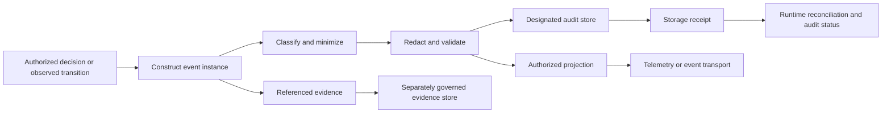

# Event And Audit Storage Boundary

NexFlow declares event types and specifies a future event-instance envelope for
auditable state transitions. A future runtime may persist selected event
instances as audit records, export projections, and retain referenced evidence.

This document defines the boundary between those responsibilities. It is a
runtime-neutral specification contract, not a storage API, event-instance
schema, database design, broker protocol, telemetry pipeline, or runtime
implementation.

Related documents:

- [Event Model](events.md)
- [RFC-0009: Event Envelope](../rfcs/RFC-0009-event-envelope.md)
- [Event Interoperability](event-interoperability.md)
- [Security Model](security-model.md)
- [Memory Model](memory-model.md)
- [Conformance](conformance.md)
- [Compatibility](compatibility.md)

## Goals

- distinguish event declarations, event instances, audit records, evidence,
  projections, and storage receipts
- keep authorization and state-transition authority outside storage systems
- minimize, classify, and redact sensitive data before persistence or export
- preserve honest identity, timing, causation, sequence, duplicate, and gap
  semantics without claiming a global order
- make retention, deletion, access, integrity, durability, and failure behavior
  visible in runtime claims
- keep audit storage separate from context, memory, telemetry, and event sourcing
- let different storage technologies satisfy the same safety boundary

## Non-Goals

This document does not:

- select a database, append log, broker, object store, SIEM, collector, or cloud
  service
- define a universal event storage API, query language, wire protocol, or
  event-instance JSON Schema
- add transport, sink, index, archive, or retention fields to `EventSet`
- require event sourcing, command handling, replay-driven state reconstruction,
  or a single source of project state
- promise exactly-once delivery, a global total order, complete wall-clock
  accuracy, or tamper-proof storage
- define legal, regulatory, records-management, incident-response, or discovery
  compliance for a deployment
- make telemetry, provider traces, debug logs, or external events authoritative
- implement an event store, audit logger, exporter, runtime, or CLI command

## Storage Concepts

The following concepts have different authority and lifecycle:

| Concept | Meaning | Authority boundary |
| --- | --- | --- |
| Event type declaration | An `EventSet` entry describing a type, expected payload, retention guidance, and audit requirement. | Authors vocabulary; it is not an event instance or storage configuration. |
| Event instance | One structured record that a state transition occurred, using the NexFlow envelope. | Evidence of an occurrence; it does not authorize the occurrence. |
| Audit record | An event instance accepted for durable review under an effective audit policy, plus storage metadata kept outside core event meaning. | Supports accountability; it is not workflow, approval, permission, or human-override authority. |
| Evidence artifact | A referenced document, decision, approval, output, trace, or other supporting material. | A reference does not grant access, prove integrity, or copy the evidence into the event. |
| Event projection | A representation such as CloudEvents or an OpenTelemetry EventRecord. | Carries selected event meaning; it is not automatically the durable audit record. |
| Delivery record | A runtime-owned result for an attempt to write or export an event. | Describes delivery only; it does not prove the underlying transition. |
| Storage receipt | Sink evidence that a particular event ID was accepted, rejected, duplicated, or assigned storage metadata. | Supports reconciliation; sink metadata must not redefine the event. |
| Search index | A derived structure for finding records. | May be incomplete or delayed and must not silently become the system of record. |
| Evidence store | A separately governed location for referenced sensitive or large evidence. | Has its own access, classification, retention, deletion, and integrity policy. |

A deployment may use one technology for several roles, but its conformance claim
must name the roles and boundaries explicitly. Product branding or a shared
backend does not merge their semantics.

## Authority Invariants

Audit storage is downstream of authorization and state-transition decisions.

- An event declaration does not authorize emission, persistence, export, or an
  action.
- An event instance does not grant capability, permission, autonomy, context,
  memory, network, credential, provider, extension, or approval authority.
- Successful audit persistence does not make a denied or unauthorized action
  valid.
- A stored approval event is evidence of a decision, not a reusable approval
  token.
- A sink, index, exporter, administrator role, or retention policy must not
  rewrite project state or resume blocked work.
- A received CloudEvent, telemetry record, provider trace, or external audit
  record remains external evidence until an explicit authenticated importer and
  local transition policy accepts it.
- Reading audit records is information access and requires an independently
  authorized context and data-handling path.

A designated audit store may be authoritative for a runtime's stated audit
retention and completeness claim. It is never authoritative for permission,
approval, workflow, task, handoff, memory, or human-override state merely
because it stores records about those domains.

## Responsibility Split

| Responsibility | Runtime host or policy layer | Storage component |
| --- | --- | --- |
| Decide whether an action is allowed | Owns | Must not infer or grant. |
| Determine whether an audit record is required | Owns from project and runtime policy | Receives the requirement and reports support. |
| Construct core event meaning | Owns actor, subject, type, correlation, causation, payload, and policy references | Preserves accepted meaning. |
| Classify and minimize data | Owns before delivery | Enforces accepted classification and rejects unsupported handling. |
| Apply required redaction | Owns before queue, persistence, indexing, or export | Must not restore or bypass removed data. |
| Assign event identity | Owns one stable identity before first delivery | Deduplicates or reports collision according to contract. |
| Assign storage metadata | Interprets receipts without changing the core event | Owns sink-local acceptance time, partition, offset, object version, or receipt ID. |
| Enforce access and tenant boundaries | Owns end-to-end policy | Enforces store-local controls and reports limitations. |
| Enforce retention and deletion | Resolves effective policy and tracks obligations | Executes supported lifecycle operations and returns evidence. |
| Explain gaps and failures | Owns the complete cross-sink view | Reports accurate local outcomes without hiding partial success. |
| Export projections | Selects mapping and authorized destination | May transport an already allowed projection; cannot broaden it. |

Storage rejection is a runtime fact, not permission to fall back to a weaker
sink or a local debug log.

## Record Lifecycle

A future runtime should process an audit-required transition in this order:

1. evaluate the action, transition, permission, approval, human-override, and
   applicable project policy
2. capture source facts without treating storage as decision authority
3. construct one event instance with a stable event ID and explicit event type
4. classify the event and every referenced or embedded data element
5. minimize payloads and replace sensitive or large content with governed
   references where possible
6. apply required redaction before any general log, queue, store, index, or
   export receives the record
7. validate the resulting envelope and the selected storage policy
8. deliver to the designated audit store using a bounded, idempotent policy
9. preserve the storage result and reconcile duplicate, delayed, partial, or
   unknown outcomes
10. create only separately authorized and versioned export projections

Validation after redaction must confirm that required audit meaning remains.
Redaction that removes the actor, subject, decision, outcome, policy reference,
or existence of a failure may make the record unusable. In that case, the
runtime must use a safer reference design or report that it cannot satisfy the
audit requirement.

## Audit Before And After Effects

Some high-risk operations may require a durable decision record before an
external side effect. A runtime policy should state which operations use this
fail-closed posture.

For such an operation:

1. the authorization or approval decision is recorded before the effect
2. failure to obtain the required durable acceptance blocks the effect
3. completion, failure, cancellation, timeout, or uncertain outcome is recorded
   separately after the attempt

The pre-effect record must not claim that the effect completed. The outcome
record must not claim success when the external result is unknown.

Lower-risk operations may permit bounded local buffering during a store outage,
but only when policy states the duration, capacity, encryption, access,
redaction, retry, overflow, shutdown, and recovery behavior. Exhaustion or loss
must be visible. A buffer is not durable merely because it is on disk.

## Identity, Duplicates, And Delivery

The runtime should assign one stable `eventId` before the first delivery
attempt. Retries and equivalent projections retain that identity.

Storage components should distinguish at least:

- accepted
- duplicate of the same event and content
- identity collision with different content
- rejected by schema, policy, size, classification, or tenant boundary
- queued but not yet durable
- unavailable or timed out
- partially written or outcome unknown

At-least-once delivery can create duplicates. Deduplication by stable event ID
must not merge a collision whose core event content differs. A runtime that
cannot distinguish duplicate from unknown outcome must report uncertainty.

An exactly-once claim requires end-to-end evidence across event construction,
queues, storage, retries, recovery, and exports. A transactional database write
or broker feature alone is insufficient.

## Time And Ordering

NexFlow preserves several different order signals:

| Signal | Meaning | Limitation |
| --- | --- | --- |
| `occurredAt` | When the source transition occurred. | Subject to source clock accuracy and delayed observation. |
| `recordedAt` | When the runtime first recorded or accepted the event for its audit path. | Must remain stable across later exports; it is not each sink's ingest time. |
| `sequence` | Monotonic position within a declared source, stream, or correlation scope. | Cannot be compared across unknown or different scopes. |
| `causationId` | Direct known causal predecessor. | Defines a partial causal relation, not a total order. |
| sink acceptance time | When one sink accepted the record. | Sink-local metadata; must not overwrite `occurredAt` or `recordedAt`. |
| broker partition or offset | Delivery position in one transport scope. | Does not establish business or causal order across partitions. |

Future runtime contracts should identify the scope of every sequence. If the
scope is not represented, consumers must treat sequence as source-local only.

Distributed events may be late, duplicated, concurrent, or out of order.
Sorting by timestamp, event ID, storage offset, or arrival time must not invent
causation. Corrections should use a new linked event or an explicit
administrative record rather than silently replacing the original event.

## Redaction And Data Minimization

Redaction is required before data crosses into a less trusted or more durable
surface. It is not a post-processing promise.

Audit records must not contain:

- credentials, passwords, private keys, session secrets, tokens, cookies, or
  authorization headers
- raw personal or regulated data unless explicit policy requires and protects
  it
- complete prompts, unrestricted context, raw memory, provider request or
  response bodies, or tool output when references or bounded summaries suffice
- hidden chain-of-thought or unsupported claims about model reasoning
- unrestricted environment, filesystem, network, tenant, or account metadata

Implementations should inspect core fields, extensions, error messages, stack
traces, URLs, query values, labels, indexes, and sink metadata. Sensitive data
can leak through metadata even when the payload is redacted.

When redaction occurs, safe metadata should identify:

- that redaction occurred
- the policy or rule reference
- a bounded reason category
- which semantic area was affected, without copying the removed value
- whether the remaining record is complete enough for its audit purpose

Hashing is not automatically redaction. Hashes of low-entropy secrets,
identifiers, or personal values may be reversible by enumeration. Content-based
event IDs and integrity digests must be calculated only over a representation
whose disclosure and correlation risks are accepted.

Raw evidence that must be retained belongs in a separately governed evidence
store. The audit record should keep a safe reference, classification, integrity
metadata when available, and access-policy reference. The reference does not
grant access to the evidence.

Debug logs, dead-letter queues, crash reports, metrics labels, and exporter
errors follow the same redaction boundary. They are not acceptable overflow
locations for prohibited audit content.

## Retention, Expiry, And Deletion

Current `EventSet.events[].retention` values are human-readable policy
declarations. They do not configure a store or prove enforcement.

A future runtime should resolve an enforceable policy from applicable sources,
which may include:

- event declaration and audit requirement
- project, organization, environment, and classification policy
- evidence-specific policy
- user or data-subject requirements where applicable
- explicit authorized hold or incident policy
- storage and export destination capabilities

Retention often contains both a minimum audit obligation and a maximum
privacy or data-handling limit. The runtime must not guess when those conflict.
It should block the affected storage path, require an explicit policy decision,
or report a conformance limitation.

Expiry and deletion should address every governed copy: primary records,
indexes, caches, replicas, queues, archives, exports, and referenced evidence.
Implementations must disclose backup, immutable-media, and downstream deletion
limitations.

A minimal tombstone may record that a record existed and was removed, but it
must not retain the prohibited content or defeat the deletion policy. Legal
hold, delayed deletion, or undeletable storage must be explicit and authorized;
an extension or sink cannot invent those exceptions.

## Access And Query Boundary

Audit write, read, search, export, retention administration, deletion, and
integrity administration are separate privileges.

A future runtime should enforce:

- project, tenant, environment, classification, and actor isolation
- least-privilege service identities and operation-scoped credentials
- separate read and write paths where practical
- explicit authorization for searches, bulk exports, and evidence retrieval
- bounded query results and redacted indexes
- audit of sensitive access without recursively copying the accessed content
- human override and approval requirements for destructive administration

An actor permitted to perform an action is not automatically permitted to read
all audit records about it. A store administrator is not automatically a
NexFlow approval authority. Using audit records as agent context requires a
declared context source and the full context, permission, classification,
network, retention, and approval path.

## Integrity And Corrections

Audit integrity should make unauthorized mutation detectable to the degree a
runtime claims. Possible mechanisms include immutable object versions,
append-oriented storage, checksums, signatures, hash chains, write-once media,
independent receipts, restricted administration, and reconciliation.

No mechanism proves that an event was truthful when first created. A checksum
does not prove actor identity, an append-only API does not prove backend
immutability, and a hash chain does not prevent an authorized administrator
from deleting the entire chain.

An integrity claim should identify:

- protected fields and canonical representation
- algorithm and key or trust-anchor lifecycle
- signer or writer identity and verification path
- mutation, deletion, truncation, and rollback threats covered
- threats and administrators not covered
- verification frequency and failure response

Corrections should preserve the original record when policy allows and add a
linked correction, supersession, or deletion record. Silent mutation is not a
correction. When policy requires physical removal, the remaining metadata must
not misrepresent the deleted content as still reviewable.

## Multiple Stores, Indexes, And Exports

A runtime may use a primary audit store, search index, telemetry backend,
archive, and evidence store together. It must state which one supports each
durability, completeness, retention, query, and integrity claim.

- Success in a telemetry exporter does not prove success in the audit store.
- Search-index absence does not prove event absence.
- Sampling is incompatible with required audit completeness unless policy
  explicitly defines the sampled surface as non-authoritative.
- A dead-letter queue is not successful persistence.
- Replication does not remove tenant, classification, residency, retention, or
  deletion obligations.
- Export destinations must receive only authorized, already-redacted
  projections.

Each sink receipt should remain namespaced storage evidence. Sink offsets,
object keys, trace IDs, and vendor request IDs must not redefine core event
identity, correlation, or causation.

## Failure, Gaps, And Reconciliation

Audit failures must not disappear inside the audit channel they affect.

A future runtime should define:

- required-store unavailability behavior
- retry, backoff, timeout, and bounded queue behavior
- duplicate and identity-collision handling
- overflow, disk-full, quota, permission, encryption, and key failure behavior
- partial success across stores and exports
- crash recovery and uncertain-write reconciliation
- gap detection, operator alerting, and health reporting outside the failed
  path
- recovery evidence and unresolved limitation reporting

An event saying "audit failed" cannot be the only signal when the event store
itself is unavailable. Runtime health, operator-visible status, independent
monitoring, or another explicitly governed channel is needed.

Required audit evidence that cannot be durably recorded should block the
related high-risk effect when policy says audit is a precondition. A runtime
must not silently continue and promise to reconstruct the record later from
telemetry, model output, or external system state.

## Event Interoperability Boundary

CloudEvents and OpenTelemetry remain projections governed by
[Event Interoperability](event-interoperability.md).

Projection happens after core event construction, classification,
minimization, and redaction. Mapping may add transport or telemetry metadata,
but it must not:

- turn sink acceptance into local transition authority
- overwrite core identity, occurrence time, correlation, or causation
- expose content prohibited from the audit record
- claim required audit completeness from sampled telemetry
- treat an external replay as a new local transition without import policy

Transport authentication, delivery, collector, broker, exporter, and backend
security remain implementation responsibilities and must be named in runtime
evidence.

## Conformance Claims

An `NF-RUNTIME` claim that includes event or audit persistence should identify:

- runtime and event-envelope versions
- covered event types, subjects, actors, and audit-required operations
- designated audit store, index, archive, projection, and evidence-store roles
- event identity, duplicate, collision, idempotency, retry, and replay behavior
- `occurredAt`, `recordedAt`, sequence-scope, causation, clock, and ordering
  behavior
- classification, minimization, redaction, and prohibited-content coverage
- pre-effect audit requirements and store-outage behavior
- durability, buffering, replication, backup, and recovery assumptions
- retention, expiry, hold, deletion, tombstone, and downstream-copy limitations
- access, query, export, tenant, credential, encryption, and key boundaries
- integrity mechanisms, verification, correction, and uncovered threats
- multi-sink partial success, gap detection, reconciliation, and operator
  visibility
- CloudEvents or OpenTelemetry mapping profiles and sink limitations when used
- focused evidence for accepted, duplicate, rejected, delayed, redacted,
  deleted, unavailable, partial, and uncertain cases

Claims such as "audit logging enabled", "append-only", "encrypted", or
"OpenTelemetry supported" are insufficient without the exact scope,
limitations, policy, and evidence.

No event-instance validator, audit store, persistence adapter, broker,
exporter, collector, evidence store, retention engine, or runtime conformance
evidence exists in this repository today.

## Compatibility

Storage behavior may change without a manifest diff. The following can be
runtime-, privacy-, safety-, audit-, or interoperability-breaking:

- changing which records are audit-required or which store is authoritative
  for completeness
- changing event identity, duplicate, retry, replay, or collision behavior
- changing timestamp, sequence scope, causation, or ordering interpretation
- changing redaction timing, prohibited fields, classification, or index
  exposure
- changing audit-before-effect, buffering, overflow, or outage behavior
- changing durability, replication, recovery, gap, or reconciliation claims
- changing retention, deletion, hold, tombstone, backup, or export behavior
- changing access, tenant, credential, encryption, key, or administrator
  boundaries
- changing integrity, correction, signature, checksum, or verification meaning
- changing evidence references or treating telemetry as authoritative storage

Audit storage implementation versions are independent from manifest
`specVersion`. A future runtime must bind support claims and evidence to exact
storage, projection, policy, and runtime versions.

## Implementation Readiness Checklist

Before implementing event and audit storage, the Runtime Architecture Decision
should settle:

- event-instance validation and host-to-storage interfaces
- designated audit store, index, archive, projection, and evidence roles
- stable identity, idempotency, duplicate, collision, and receipt formats
- classification, minimization, redaction, and safe reference handling
- timestamp ownership, sequence scopes, causation, and ordering contracts
- pre-effect persistence, buffering, retry, crash recovery, and gap policy
- access, tenant isolation, credentials, encryption, keys, and administration
- retention, hold, expiry, deletion, backup, and downstream propagation
- integrity, correction, verification, and reconciliation evidence
- exporter, collector, broker, and telemetry separation
- conformance fixtures and compatibility policy

Until those decisions and implementations exist, event and audit storage
remains a specified future boundary only.
