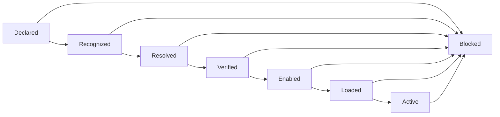

# Extension Loading Boundary

NexFlow extension declarations describe non-core behavior. They do not locate,
install, trust, load, or authorize executable code.

This document specifies the safety boundary a future runtime must preserve when
it discovers and loads an extension implementation. It is a runtime-neutral
contract, not a loader design, package format, registry, manifest schema, or
claim that extension execution exists in this repository.

Related documents:

- [Extension Model](extensions.md)
- [Extension Namespaces](../rfcs/RFC-0006-extension-namespaces.md)
- [Architecture](architecture.md)
- [Security Model](security-model.md)
- [Manifest Discovery](manifest-discovery.md)
- [Network Access Policy](network-access-policy.md)
- [Conformance](conformance.md)

## Goals

- keep project declarations separate from executable implementation discovery
- require an exact, inspectable match between a namespace and supported code
- fail closed for unknown, ambiguous, unverified, or unsupported behavior
- prevent extension presence, installation, or activation from granting access
- preserve permission, approval, context, memory, network, credential, autonomy,
  and human-override authority
- make loading and rejection decisions auditable without exposing secrets

## Non-Goals

This document does not:

- choose a runtime language, package manager, process model, or sandbox
- define a central extension registry
- define an executable package or lock-file schema
- add fields to `ExtensionSet`
- install, load, or execute the maintained MCP or A2A profiles
- make a schema-valid extension safe or supported
- allow an extension to enforce core policy on behalf of the runtime

## Separate Trust Domains

A future implementation must keep these artifacts distinct:

| Artifact | Purpose | Authority it does not have |
| --- | --- | --- |
| `ExtensionSet` declaration | Names requested extension behavior, lifecycle, attachment areas, and required capabilities. | It does not identify trusted code, request installation, or grant access. |
| Maintained extension profile | Defines versioned policy mapping and validation evidence for a namespace. | It is not executable code or proof that a runtime supports the namespace. |
| Runtime support record | States which namespace, profile version, implementation artifact, and behavior a runtime supports. | It cannot override project policy or authorize an action. |
| Implementation artifact | Contains code that may implement supported extension behavior. | Its metadata, signature, publisher, or installation does not grant runtime authority. |
| Activated instance | Runs one verified implementation inside a constrained host boundary. | It receives only the handles allowed for that instance and action. |

Moving from one row to the next requires an explicit decision. A runtime must
not infer executable support from a namespace, documentation URL, package name,
registry result, installed dependency, executable on `PATH`, or protocol SDK.

## Two Discovery Processes

### Project Declaration Discovery

Project discovery identifies `ExtensionSet` documents as part of a logical
NexFlow assembly. It follows the explicit local source rules in
[Manifest Discovery](manifest-discovery.md).

Project declaration discovery may establish that a project requests a
namespace. It must not:

- scan the filesystem for matching implementation code
- resolve `documentation` as a package or download location
- query a registry
- install a dependency
- open a network connection
- activate an extension

Unknown declarations should be preserved when safe round-tripping is possible.
Preservation is data handling, not support or authorization.

### Implementation Discovery

Implementation discovery belongs to the future runtime, outside project
manifests. It must start from explicit, administrator- or deployment-controlled
sources such as:

- a pinned runtime distribution
- an explicit implementation catalog
- an immutable deployment lock record
- an administrator-configured local directory with a defined trust policy

By default, a runtime must not search ambient locations such as the current
directory, user home, global package cache, environment-defined plugin path,
system `PATH`, arbitrary manifest-relative directory, or remote registry.

Remote metadata lookup, package download, and installation are separate
networked operations. Each requires explicit policy, destination controls,
integrity expectations, credentials when needed, and audit. A lookup result
must never trigger automatic installation or activation.

## Resolution Identity

A loader must resolve an extension against an exact support record. The record
should identify at least:

- extension namespace
- supported extension or profile version
- supported NexFlow `specVersion` values
- supported attachment areas and behavior
- implementation name and immutable version
- implementation artifact digest
- source or distribution identity
- required host interface version
- isolation mode and known limitations

This information is future runtime configuration or conformance evidence, not a
new NexFlow manifest kind.

Mutable labels such as `latest`, an unpinned branch, or a package name without a
resolved version and digest are insufficient for activation. Namespace and
package identity are separate: a package with a matching name does not prove
namespace ownership, and one package must not claim a reserved namespace
without the applicable trust decision.

When multiple implementations match the same namespace and requested behavior,
the runtime must reject the ambiguity unless deployment policy selects one
exact implementation deterministically. Discovery order, filesystem order, or
package-manager order must not decide precedence.

## Loading State Model

A future runtime should expose these distinct states or equivalent evidence:

| State | Meaning |
| --- | --- |
| `declared` | The project assembly requests the namespace. |
| `recognized` | The runtime has an explicit support record for it. |
| `resolved` | One exact implementation and profile version match. |
| `verified` | Provenance, integrity, compatibility, and host requirements pass. |
| `enabled` | Deployment policy permits this implementation for this project. |
| `loaded` | Code is initialized inside the selected isolation boundary. |
| `active` | The instance may receive only individually authorized operations. |
| `blocked` | Loading or use stopped with a factual reason. |

No state implies the next. In particular, `loaded` does not mean `active`, and
`active` does not pre-authorize every operation the extension can request.

A failure, unsupported requirement, revoked approval, human override, integrity
change, or policy change can move an implementation to `blocked`. Resume must
re-evaluate the invalidated stages rather than restoring prior authority.

## Unsupported Extension Handling

Unsupported behavior must be visible and inert.

| Condition | Required outcome |
| --- | --- |
| Unknown namespace | Preserve declaration when safe, report unsupported namespace, and do not load. |
| Supported namespace, unsupported profile version | Report the exact mismatch and block the affected behavior. |
| Missing implementation | Report implementation unavailable; do not search or install implicitly. |
| Ambiguous implementation match | Block until one immutable implementation is selected explicitly. |
| Integrity or provenance failure | Block loading and record non-sensitive evidence. |
| `experimental` lifecycle | Require runtime and deployment policy to opt in explicitly. |
| `deprecated` lifecycle | Report deprecation and apply documented support policy; never substitute a replacement silently. |
| `removed` lifecycle | Reject loading for the target compatibility range. |
| Unsupported attachment area or behavior | Keep that behavior inert; do not reinterpret it as a nearby supported feature. |
| Unsupported required capability | Block activation that depends on it; do not create or grant the capability. |
| Missing permission, approval, network rule, context access, memory access, or credential binding | Deny the affected operation. |

Partial support is valid only when a runtime claim enumerates the supported
surface and the remaining fields are optional, preserved, and inert. If an
unsupported surface is required for the extension's declared behavior, the
extension must be blocked instead of degraded silently.

Diagnostics should distinguish at least namespace, version, implementation,
integrity, lifecycle, policy, authority, isolation, and ambiguity failures.
This document defines categories, not stable CLI diagnostic codes.

## Authorization Is Evaluated After Loading

Extension resolution produces an implementation candidate, never an authority
grant. Before each operation, a future runtime must intersect:

1. behavior requested by the project and active agent definition
2. behavior explicitly supported by the selected implementation
3. runtime and deployment policy
4. actor capability declaration
5. applicable permission rules, with deny taking precedence
6. approval-gate state and scope
7. autonomy limits
8. context and memory access boundaries
9. network access policy
10. credential bindings
11. current human-override state

An empty or unresolved intersection denies the operation.

`requiredCapabilities` is a precondition declaration. It does not create a
capability, attach it to an actor, grant permission, satisfy approval, open a
network destination, provide a credential, or raise autonomy.

Approval to install, enable, or activate an implementation is not approval for
its later actions. An extension must not cache a prior allow decision and reuse
it after policy, scope, actor, task, approval, credential, or human-override
state changes.

An extension must not create local actors, tasks, handoffs, artifacts, context
sources, memory scopes, capabilities, permissions, or approvals merely because
an external system advertises equivalent objects. Any import requires the
explicit local binding and provenance rules for that surface.

## Host Isolation

The Runtime Architecture Decision may choose a process, WebAssembly, container,
or another isolation model. Regardless of mechanism, the host boundary must be
deny-by-default.

An extension should receive mediated, operation-scoped handles instead of
ambient host authority. It must not receive by default:

- process environment or raw credential values
- unrestricted filesystem or repository access
- arbitrary outbound or inbound network access
- subprocess or shell execution
- host IPC, sockets, or device access
- unrestricted context or memory stores
- provider clients or deployment credentials
- runtime-internal policy mutation interfaces

The host should validate inputs and outputs, bound resource use, support
cancellation and timeout, isolate crashes, and revoke handles when authorization
changes. An extension crash or protocol error must not disable permission,
approval, audit, network, credential, or human-override enforcement.

Core policy decisions remain host-owned. An extension may provide facts or
request an action through a versioned interface, but it must not become the
sole authority deciding whether its own request is allowed.

## Installation And Updates

Installation, enablement, loading, and activation are separate operations.

A future installation flow should record immutable artifact identity,
provenance, digest, dependency inventory, license evidence, known vulnerability
results, supported host interface, and review decision. A signature can support
provenance and integrity; it does not prove safety or grant permissions.

An update must be treated as a new implementation resolution. It must not
activate automatically when it:

- changes artifact digest or publisher identity
- adds required capabilities
- broadens network, credential, context, or memory needs
- changes attachment areas or external protocol behavior
- weakens isolation requirements
- changes lifecycle or compatibility claims

Rollback should select another previously verified immutable artifact. It must
not restore expired approvals, revoked credentials, prior network grants, or
superseded policy decisions.

## Audit Evidence

Loading and use should record enough evidence to explain:

- project and assembly revision
- namespace and requested profile version
- selected implementation name, version, digest, and source
- support-record and host-interface versions
- lifecycle and compatibility decision
- verification, enablement, loading, activation, rejection, and termination
- requested versus permitted capabilities and surfaces
- approval, permission, network, credential-reference, and human-override
  decisions that affected an operation
- instance identity and operation correlation

Audit data must redact secrets, raw credential values, sensitive payloads, and
unnecessary personal data. A credential reference may be recorded where policy
allows; the credential value must not be recorded.

## Conformance And Compatibility

An `NF-EXTENSION` or `NF-RUNTIME` claim involving executable loading should
identify:

- every supported namespace and profile version
- exact implementation and host versions
- supported NexFlow `specVersion` range
- supported attachment areas and behavior
- implementation discovery sources
- integrity and provenance checks
- isolation and resource-control behavior
- permission, approval, network, credential, context, memory, audit, and human
  override enforcement coverage
- unsupported behavior and failure mode

Claims such as "supports extensions" or "supports MCP" are insufficient. A
loader that recognizes metadata but cannot safely activate code may claim that
bounded recognition behavior, not executable extension support.

Changing discovery defaults, implementation precedence, lifecycle handling,
integrity requirements, isolation, host interfaces, authorization order,
partial-support behavior, or failure policy may be security-significant and
compatibility-breaking even when `ExtensionSet` schema remains unchanged.

## Implementation Readiness Checklist

Before an executable loader is implemented, the Runtime Architecture Decision
should settle:

- implementation catalog and immutable lock format
- package provenance and integrity policy
- namespace ownership and reserved-namespace verification
- host interface and compatibility versioning
- isolation, resource limits, cancellation, and crash containment
- installation, update, rollback, and revocation behavior
- per-operation authorization and handle revocation
- audit event names, payloads, ordering, retention, and redaction
- stable diagnostic codes and machine-readable inspection output
- conformance fixtures for unknown, ambiguous, unsupported, tampered, denied,
  revoked, deprecated, and removed cases

Until those decisions and an implementation exist, NexFlow extension loading
remains specified only as a future safety boundary.
