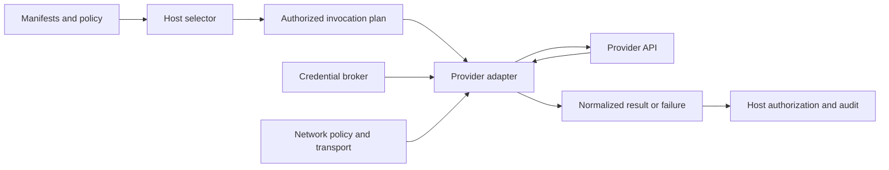

# Provider Adapter Boundary

NexFlow provider declarations and model profiles describe provider-neutral
selection intent. A provider adapter is a future runtime component that
translates one already selected and authorized invocation into a specific
provider API and normalizes the result.

This document defines the boundary between the future runtime host and provider
adapters. It is a specification contract, not an adapter API, package format,
provider client, model router, credential broker, network transport, or runtime
implementation.

Related documents:

- [Provider Abstraction](provider-abstraction.md)
- [Provider Features](provider-features.md)
- [Provider Constraints](provider-constraints.md)
- [Model Profiles](model-profiles.md)
- [Network Access Policy](network-access-policy.md)
- [Extension Loading Boundary](extension-loading-boundary.md)
- [Event And Audit Storage Boundary](event-audit-storage-boundary.md)
- [Security Model](security-model.md)
- [RFC-0010: Provider Selection](../rfcs/RFC-0010-provider-selection.md)

## Goals

- keep provider selection and policy enforcement outside provider-specific code
- make request translation deterministic and inspectable
- prevent adapters from granting network, credential, context, memory, tool, or
  fallback authority
- distinguish retry from provider or model fallback
- normalize outcomes without erasing provider-specific evidence
- produce sufficient audit explanations without recording sensitive payloads
- let built-in and extension-backed adapters follow the same safety contract

## Non-Goals

This document does not:

- implement or select OpenAI, Anthropic, Google, OpenRouter, Ollama, or another
  provider
- select a runtime language, HTTP client, SDK, package manager, or sandbox
- define a universal model inference API
- add fields to `ProviderSet`, `ModelProfileSet`, or another manifest
- make current provider declarations live availability claims
- allow a reference CLI to call providers
- standardize provider pricing, rate limits, tokenization, safety systems, or
  legal terms
- define the complete credential boundary or audit storage design; those remain
  separate runtime architecture work

## Host And Adapter Responsibilities

The runtime host remains the policy authority. The adapter remains a bounded
translator and invoker.

| Responsibility | Runtime host | Provider adapter |
| --- | --- | --- |
| Resolve active agent definition and model profile | Owns | Receives resolved references only. |
| Select provider and model candidate | Owns | Must not replace the selected target. |
| Evaluate provider and model constraints | Owns | Verifies that the invocation is within declared adapter support. |
| Enforce permissions, approvals, autonomy, context, memory, and human override | Owns | Must not bypass or reinterpret host decisions. |
| Grant network and credential access | Owns through mediated boundaries | Uses only operation-scoped handles. |
| Translate provider-neutral input | Supplies normalized invocation plan | Maps the plan to one documented provider request. |
| Execute provider-native tools | Authorizes each local action separately | May return tool requests as proposals; must not execute them. |
| Decide retry and fallback | Owns final decision | Reports normalized outcome and bounded retry evidence. |
| Normalize provider response | Validates host contract | Maps one provider response or stream into normalized output. |
| Emit authoritative audit decision | Owns | Supplies adapter evidence without raw sensitive traces. |

An adapter may reject an invocation that it cannot represent safely. It must
not broaden the request to make it succeed.

## Adapter Support Record

A future runtime should resolve an adapter through an explicit support record.
The record should identify at least:

- adapter name and immutable version
- implementation artifact identity or digest when separately packaged
- supported provider types and provider API or protocol versions
- supported NexFlow `specVersion` values
- supported model classes, operations, provider features, and modalities
- supported request parameters and provider-specific extension fields
- parameter mappings and material provider defaults
- streaming, structured output, tool request, and cancellation behavior
- credential mechanisms and expected network destination classes
- normalized error and usage mappings
- retry support and provider-managed routing behavior
- audit, redaction, context retention, and known limitations
- host interface and conformance evidence versions

This record is future runtime configuration or conformance evidence, not a
NexFlow project manifest or proof that an operation is authorized.

A matching provider `type`, SDK package, API hostname, or installed adapter is
not enough. Resolution must select one exact supported adapter deterministically.
If more than one adapter matches, deployment policy must choose one explicitly;
registration order, filesystem order, or package-manager order must not decide.

## Authorized Invocation Plan

The host should pass an adapter an immutable, operation-scoped invocation plan.
The plan is a derived runtime artifact and not a new manifest kind.

The plan should carry, when applicable:

| Area | Expected information |
| --- | --- |
| Identity | Request, attempt, actor, agent definition, task, workflow, and correlation references. |
| Selection | Model profile, selection mode, selected provider, resolved model or alias, revision, selection reason, and fallback state. |
| Operation | Requested model class or operation, input and output modalities, streaming mode, structured output expectations, and required provider features. |
| Data | Prompt, context, and memory inputs already allowed for this operation, plus classification, retention, training-use, and residency constraints. |
| Tools | Exact provider-visible tool schemas and identifiers that the host permits the model to request. |
| Limits | Timeout, cancellation, output, usage, cost, and retry budgets decided by host policy. |
| Authority | References to effective permission, approval, network, credential, and human-override decisions. |
| Adapter | Exact adapter and host-interface version selected for the attempt. |
| Audit | Required evidence and redaction expectations. |

The plan must contain only inputs approved for the selected provider and
operation. The adapter must not retrieve additional context, read memory,
resolve prompt sources, inspect unrelated files, discover tools, or query a
model catalog unless the host has separately authorized and represented that
operation.

## Preflight

Before a network request, the adapter and host should confirm:

1. the exact adapter supports the selected provider type, API version,
   operation, model reference, and required features
2. every required provider-neutral field has a documented mapping
3. every provider-specific extension field is explicitly supported and allowed
4. unsupported optional fields can remain inert without changing semantics
5. credential and network handles exist for the exact target
6. request size, timeout, streaming, tool, structured output, and usage limits
   are enforceable
7. required audit and redaction evidence can be produced
8. the host authorization snapshot and human-override state remain valid

If a required field, feature, policy, or evidence item cannot be represented,
the attempt must be blocked. An adapter must not silently omit a requirement,
substitute a nearby feature, weaken structured output, change tool mode, or rely
on a more permissive provider default.

## Request Translation

Translation should be deterministic for the same invocation plan, adapter
version, and explicitly supplied runtime facts.

An adapter must document:

- how provider-neutral model and operation identifiers map to provider fields
- how prompt roles, message order, multimodal parts, and structured output map
- how tool declarations and tool-choice limits map
- which generation, embedding, reranking, or other parameters are supported
- which provider defaults remain material when a field is omitted
- how token, byte, item, time, and cost limits are converted
- how cancellation and idempotency are represented
- which provider-specific fields are accepted, ignored, rejected, or returned
  as extension-scoped evidence

Material defaults must be explicit in the adapter support record or invocation
evidence. A provider's changing default must not silently alter a pinned or
policy-constrained request.

Provider-required wrappers may be added only when documented and semantically
bounded. An adapter must not insert undisclosed behavioral prompts, remove host
safety instructions, reorder meaningful roles, expand context, or transform a
tool proposal into execution.

## Credential And Network Boundary

Provider declarations, selection, adapter support, and installation do not
grant connectivity or credentials.

A future adapter should receive operation-scoped handles from host-owned
credential and network boundaries. It should not receive by default:

- the complete process environment
- a general secret store
- credentials for other providers, projects, tenants, or environments
- unrestricted DNS, proxy, redirect, socket, or outbound network access
- permission to choose a different provider endpoint

Credential values must not enter manifests, normalized results, diagnostics,
audit records, exceptions, or provider traces. A safe reference or broker handle
may be recorded when policy allows.

Every connection must satisfy the structured
[Network Access Policy](network-access-policy.md), including destination,
scheme, port, redirect, resolved address, purpose, classification, approval,
and audit requirements. A provider SDK's telemetry, update, discovery, or
fallback endpoint is a separate destination and must not inherit access from
the primary API endpoint.

The broader credential boundary remains separate runtime architecture work.
Until that work is complete, this document requires opaque, least-privilege,
operation-scoped credential handling without selecting a secret manager or
broker design.

## Provider-Specific Extensions

Provider-specific metadata should remain namespaced. An adapter may interpret a
field only when its support record names the namespace, field, version, mapping,
security impact, and compatibility behavior.

Unknown provider-specific fields should be preserved when safe but must remain
inert. They must not:

- enable tools or network access
- select another provider or model
- provide a credential or account
- broaden context or memory
- weaken training-use, residency, retention, or sensitivity constraints
- bypass approval or human override

An adapter packaged as an extension must also satisfy the
[Extension Loading Boundary](extension-loading-boundary.md). Loading the
adapter extension does not authorize provider use.

## Response Normalization

An adapter should return a normalized result that distinguishes:

- completed output
- partial or streamed output
- provider-requested tool calls
- provider safety or content-policy outcomes
- cancellation
- bounded usage and cost evidence
- normalized failure

The result should identify, when safe and available:

- request and attempt identity
- adapter name and version
- selected provider and model profile
- actual provider and resolved model reported by the provider
- resolved model revision or alias evidence
- finish reason
- usage units with their provider-specific basis
- provider request identifier as sensitive audit metadata
- warnings, lossy mappings, and unsupported response fields
- whether output is complete, partial, cached, or replayed

Raw provider responses may contain prompts, context, memory, tool outputs,
account metadata, internal safety signals, or credentials. They should not
become core audit payloads. If retained for debugging, they require separate
classification, access, retention, redaction, and deletion policy.

## Tool Request Boundary

A provider response that requests a tool is a proposal, not execution authority.

The adapter must:

1. normalize the requested tool identity and arguments
2. validate structural bounds before returning the proposal
3. preserve the provider response correlation needed for a later continuation
4. return control to the runtime host

The runtime must re-evaluate actor capability, permission, approval, autonomy,
task and workflow scope, context, memory, network, credential, and human
override policy before executing any tool. Tool output sent back to the model is
a new provider invocation and requires a fresh data-sharing and authorization
decision.

An adapter must not execute shell commands, MCP tools, provider-native tools,
repository operations, or external actions directly because the model requested
them.

## Streaming And Stateful Sessions

Streaming must preserve cancellation, ordering, backpressure, output limits,
and failure state. Raw streamed tokens should not be copied into audit logs by
default. A final result must distinguish complete output from a stream that
ended after partial delivery.

Automatic retry after partial output can duplicate text, tool proposals, or
downstream effects. It must be denied unless the host has an explicit replay
and deduplication contract for that operation.

Adapters should be stateless between attempts by default. Provider conversation
or response IDs are opaque remote references, not NexFlow memory. Reusing remote
session state must be explicit because it may retain context outside declared
memory scopes, training-use expectations, residency, or retention policy.

Cancellation must revoke or stop operation-scoped handles where practical. A
provider that cannot guarantee cancellation should be reported as such; the
adapter must not claim that remote processing stopped merely because the local
request was abandoned.

## Retry And Fallback

Retry and fallback are separate decisions.

### Same-Target Retry

A retry repeats the semantically equivalent invocation against the same
selected provider, model, adapter, policy snapshot, credential scope, and
network destination.

The host may permit a bounded retry for transient conditions such as rate
limiting, timeout before output, or provider unavailability. Retry policy should
define attempt count, elapsed budget, backoff, jitter, provider `Retry-After`
handling, idempotency, cancellation, and audit.

An adapter must not retry automatically when:

- authorization, approval, credential, or network policy denied the request
- input is invalid or a required feature is unsupported
- provider policy or content policy blocked the request
- output or a tool proposal may already have been delivered
- the retry would change model, endpoint, region, account, data use, or request
  semantics
- the authorization snapshot or human-override state is no longer valid

### Provider Or Model Fallback

Fallback selects a different provider, model, region, deployment, adapter, or
provider-managed route. It is never an adapter-local retry.

When fallback is allowed, the adapter returns a normalized failure or routing
fact to the host. The host must rerun the RFC-0010 selection path and re-evaluate:

- model profile fallback policy and candidate set
- provider and model constraints
- permissions and approvals
- context and memory compatibility
- network destination and credential scope
- training use, residency, retention, sensitivity, tool use, cost, and latency
- audit requirements and current human-override state

Approval for the preferred target does not automatically approve fallback.
Every fallback attempt receives a new attempt identity and a new authorized
invocation plan.

Provider-managed model substitution, regional failover, or routing is fallback
when it can change a material selected property. It must be disabled, bounded by
an explicit reviewed contract, or surfaced to the host before use. An adapter
must not hide it behind a stable provider name.

## Normalized Failure Categories

A future adapter should classify failures without making raw provider codes the
core control contract. Candidate outcome categories include:

- `invalid_invocation`
- `unsupported_operation`
- `policy_blocked`
- `approval_required`
- `credential_unavailable`
- `authentication_rejected`
- `network_denied`
- `rate_limited`
- `quota_exceeded`
- `provider_unavailable`
- `timeout`
- `response_invalid`
- `content_blocked`
- `cancelled`
- `unknown`

These are runtime outcome categories, not Stable NexFlow diagnostic codes or a
machine-readable schema. The future Runtime Architecture Decision must review
their exact names, fields, retry meaning, and compatibility.

A normalized failure should include safe provider evidence, attempt stage,
whether any output may have been delivered, and an advisory retry class. The
host owns the final retry or fallback decision. HTTP status alone is not enough:
the same status may represent invalid input, authentication, policy, quota, or
transient provider failure.

Raw provider error codes may be retained as redacted, provider-namespaced
details. Unknown failures must remain unknown rather than being guessed into a
retryable category.

## Explainability And Audit

Provider execution should preserve four distinct explanations:

1. **Selection**: why the host selected the provider and model.
2. **Translation**: how the adapter mapped the authorized invocation.
3. **Attempt**: which credential scope, network policy, endpoint class, limits,
   and adapter version were used.
4. **Outcome**: what completed, failed, was blocked, retried, or fell back.

Audit evidence should include, when safe and applicable:

- project, actor, agent definition, task, workflow, request, correlation, and
  attempt references
- model profile, selection mode, selected provider and model, actual provider
  and model, and adapter identity
- selection reason, policy decision, constraints applied, and rejected-candidate
  summaries produced by the host
- provider-specific mappings or defaults that materially affected behavior
- approved tool surface and whether a tool proposal was returned
- context, memory, prompt, and output classifications and source references,
  not raw content
- permission, approval, human override, network-rule, and credential-reference
  evidence
- attempt count, fallback chain, fallback reason, and whether approval changed
- timeout, cancellation, streaming, partial-output, and replay status
- normalized usage, cost basis, outcome, failure category, and provider request
  reference
- redactions, lossy mappings, unsupported evidence, and known uncertainty

An adapter must not claim why another candidate was rejected unless the host
provided that selection evidence. Provider-native traces remain
provider-specific evidence and must not become local authority.

Audit records must not contain raw credentials, authorization headers, complete
prompts, unbounded context or memory, sensitive tool outputs, or unnecessary
personal data. Persistence, retention, deletion, ordering, integrity, and
storage failure follow the
[Event And Audit Storage Boundary](event-audit-storage-boundary.md).

## Conformance Claims

An `NF-RUNTIME` claim that includes provider execution should identify:

- runtime, selector, adapter, and host-interface versions
- supported NexFlow `specVersion` values
- supported provider types, API versions, operations, model classes, features,
  modalities, and provider-specific extension fields
- request mappings, material defaults, lossy behavior, and unsupported fields
- credential and network enforcement coverage
- prompt, context, memory, tool, structured output, and streaming boundaries
- retry, fallback, provider-managed routing, cancellation, and replay behavior
- response, usage, finish-reason, tool-request, and error normalization
- audit, redaction, retention, and raw-trace policy
- focused evidence for denied, unsupported, transient, partial, fallback, and
  sensitive-data cases

Claims such as "supports providers", "supports OpenAI-compatible APIs", or
"supports model fallback" are insufficient without exact versions, mappings,
boundaries, and limitations.

No provider adapter, provider call, live availability check, fallback engine, or
provider execution conformance evidence exists in this repository today.

## Compatibility

Adapter behavior may change without a manifest diff. The following can be
behavior-, safety-, privacy-, cost-, audit-, or runtime-breaking:

- changing model or operation mapping
- changing prompt-role or message-order translation
- adding, removing, or changing a material provider default
- changing tool schema, structured output, streaming, or finish-reason mapping
- changing actual-model detection or provider-managed routing behavior
- changing retry eligibility, idempotency, fallback signaling, or error mapping
- changing credential scope, network destinations, telemetry, or remote session
  reuse
- changing usage units, cost basis, audit fields, redaction, or raw trace
  retention
- changing unsupported-field behavior from reject to ignore or the reverse

Adapter versioning is independent from manifest `specVersion`. A future runtime
must bind its support claim and audit evidence to the exact adapter version and
must review behavior-changing updates before activation.

## Implementation Readiness Checklist

Before implementing provider adapters, the Runtime Architecture Decision should
settle:

- adapter host interface and support-record formats
- provider-neutral invocation and normalized result contracts
- adapter packaging, integrity, loading, isolation, and update rules
- credential broker and network transport interfaces
- provider-specific extension and material-default policy
- tool request, structured output, streaming, cancellation, and remote session
  behavior
- retry, idempotency, fallback, and provider-managed routing policy
- normalized failure, usage, cost, and finish-reason vocabularies
- audit event types, payloads, ordering, redaction, retention, and storage
- conformance fixtures and compatibility policy

Until those decisions and implementations exist, the provider adapter remains a
specified future boundary only.
