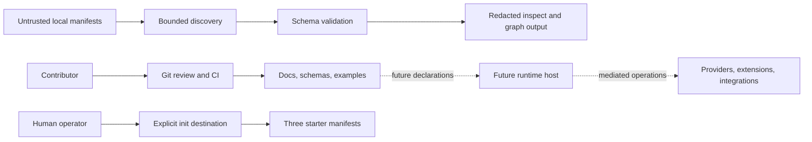

# NexFlow Threat Model

This document models threats against the current NexFlow specification
repository and the runtime described by the specification. It is an
architecture review artifact, not a vulnerability report, penetration-test
result, or claim that a NexFlow runtime exists.

Every attacker story below is a hypothesis to preserve or test. A story about a
future runtime is conditional until an implementation and deployment create
that boundary. Evidence links identify the repository state on which the model
is based.

## 1. Overview

### Intended Use And Deployment Scope

NexFlow is specification-first. The repository publishes documentation, JSON
Schemas, examples, RFCs, and maintenance tooling for describing human, AI, and
automation collaboration. It is explicitly not an agent, provider client, or
orchestration engine ([`README.md:10-14`](../README.md#L10-L14)).

The current executable surface is repository tooling:

- maintainers and contributors run Node.js checks against repository schemas,
  fixtures, and examples;
- users may run an experimental local CLI prototype to discover, structurally
  validate, inspect, or graph an explicit manifest assembly;
- users may ask that prototype to initialize three fixed starter manifests in
  an explicit existing directory;
- GitHub Actions installs pinned npm dependencies and runs the maintained check
  set on pull requests and pushes to `main` or `develop`.

There is no hosted NexFlow service, multi-tenant control plane, provider call,
credential broker, extension loader, workflow scheduler, memory backend, event
store, deployment adapter, or runtime in this repository. The README states the
same implementation boundary ([`README.md:63-71`](../README.md#L63-L71)).

The future-runtime portion of this model is a design constraint for NexFlow
Runtime, Desktop, Cloud, and third-party implementations. It does not make those
products or controls current.

### Components And Data Flows

| Component | Current role | Data or effects | Evidence |
| --- | --- | --- | --- |
| Specification docs, RFCs, schemas, and examples | Public source of authored semantics and structural contracts. | Git changes reviewed and published as repository revisions. | [`README.md:33-61`](../README.md#L33-L61), [`docs/governance.md:20-33`](governance.md#L20-L33) |
| Repository validator | Loads repository-owned schemas and maintained YAML examples. | Reads repository files and returns validation status; it does not authorize execution. | [`package.json:6-32`](../package.json#L6-L32), [`scripts/lib/schema-validation.mjs:38-81`](../scripts/lib/schema-validation.mjs#L38-L81) |
| Manifest discovery | Selects an explicit local assembly from files, Project hints, or one root Project entry point. | Reads bounded local YAML without scanning unrelated files. | [`scripts/lib/manifest-discovery.mjs:127-179`](../scripts/lib/manifest-discovery.mjs#L127-L179), [`scripts/lib/manifest-discovery.mjs:634-665`](../scripts/lib/manifest-discovery.mjs#L634-L665) |
| CLI prototype | Dispatches `discover`, `validate`, `inspect`, `graph`, and `init`. | Reads selected manifests; `init` is the only project-file write effect. No command authorizes execution. | [`scripts/lib/cli-prototype.mjs:13-35`](../scripts/lib/cli-prototype.mjs#L13-L35), [`scripts/lib/cli-prototype.mjs:168-207`](../scripts/lib/cli-prototype.mjs#L168-L207) |
| CLI diagnostics and projections | Produces text or a versioned JSON result. | Exposes bounded structural facts and redacted source locations, not raw manifests or authority. | [`scripts/lib/cli-output.mjs:6-14`](../scripts/lib/cli-output.mjs#L6-L14), [`scripts/lib/cli-output.mjs:86-115`](../scripts/lib/cli-output.mjs#L86-L115) |
| Starter initializer | Renders a built-in human-led template. | Creates only `project.yaml`, `actors.yaml`, and `agents.yaml`; skips exact matches and refuses conflicts. | [`scripts/lib/project-init.mjs:15-80`](../scripts/lib/project-init.mjs#L15-L80), [`scripts/lib/project-init.mjs:98-164`](../scripts/lib/project-init.mjs#L98-L164) |
| Repository CI | Evaluates changes on GitHub-hosted runners. | Checks out proposed code, installs npm dependencies without lifecycle scripts, and runs repository scripts. | [`.github/workflows/schema-smoke.yml:3-25`](../.github/workflows/schema-smoke.yml#L3-L25), [`.github/workflows/schema-smoke.yml:27-97`](../.github/workflows/schema-smoke.yml#L27-L97) |
| Future runtime host | Planned policy and effect boundary; absent today. | Would resolve effective configuration, authorize operations, mediate effects, and record audit evidence. | [`docs/cli-runtime-boundary.md:55-92`](cli-runtime-boundary.md#L55-L92) |
| Future providers, extensions, context, memory, and protocol adapters | Planned external trust domains; absent today. | Would exchange sensitive data or request effects only through runtime-owned policy boundaries. | [Extension Loading Boundary](extension-loading-boundary.md), [Provider Adapter Boundary](provider-adapter-boundary.md), [MCP And A2A Boundaries](mcp-a2a-boundaries.md) |

Solid paths exist in the repository today. Dotted paths are future boundaries
specified by NexFlow and must not be inferred from schema validity or CLI
success.

### Effective Resources And Capabilities

| Resource | Controller | Consumer | Current capability or limit |
| --- | --- | --- | --- |
| Repository revision | Contributor proposes; maintainer accepts. | Readers, CI, and downstream implementers. | Git review plus automated checks; repository branch-protection settings are operational state and are not proven by this repository. |
| Local manifest bytes and names | CLI operator and manifest author. | Discovery, parser, validator, and safe output projections. | Relative `.yaml` or `.yml` sources inside one canonical root; 128 documents, 1 MiB per file, and 100 aliases at most ([`scripts/lib/manifest-discovery.mjs:12-16`](../scripts/lib/manifest-discovery.mjs#L12-L16)). |
| Repository schema registry | Repository maintainers. | Structural validator. | Only repository-owned schema files are compiled; manifest `$schema` values are inert ([`scripts/lib/schema-validation.mjs:38-60`](../scripts/lib/schema-validation.mjs#L38-L60)). |
| Init destination | Local operator selects an existing directory. | Starter initializer. | Fixed filenames, exclusive creation, no overwrite flag, conflict refusal, and rollback of reserved files on failure ([`scripts/lib/project-init.mjs:87-157`](../scripts/lib/project-init.mjs#L87-L157)). |
| CLI stdout and stderr | CLI implementation. | Human or local automation invoking the prototype. | Versioned, allowlisted projections; `executionAuthorized` is always `false` ([`scripts/lib/cli-output.mjs:100-115`](../scripts/lib/cli-output.mjs#L100-L115)). |
| npm dependency artifacts | npm publishers and registry; lock file selects bytes. | Contributor and CI Node processes. | Exact top-level versions and integrity hashes in lockfile; installed with lifecycle scripts disabled ([`package-lock.json:1-20`](../package-lock.json#L1-L20), [`.github/workflows/schema-smoke.yml:21-22`](../.github/workflows/schema-smoke.yml#L21-L22)). |
| GitHub Actions and runner token | GitHub and repository administrators. | Pull-request and branch CI jobs. | Workflow uses `pull_request`, but action references use mutable major tags and token permissions are not declared in the workflow. |
| Runtime credentials, network handles, context, memory, and effect adapters | Future deployment owner. | Future runtime actors and adapters. | Not present. The specification requires independent, operation-scoped policy decisions; enforcement evidence does not yet exist. |

## 2. Threat Model, Trust Boundaries, And Assumptions

### Assets And Security Objectives

| Asset | Security objective |
| --- | --- |
| Specification meaning | Prevent a schema, example, extension, or implementation from silently broadening authority beyond the written model. |
| Release and conformance evidence | Keep claims bound to exact versions, profiles, checks, and known limitations. |
| Repository integrity | Prevent unreviewed source, workflow, dependency, or release changes from becoming trusted project state. |
| Local filesystem | Keep manifest reads inside the selected root and starter writes inside the selected destination without following symbolic links or overwriting user content. |
| Diagnostic confidentiality | Do not copy raw prompts, credentials, context, memory, absolute paths, or attacker-selected fields into output by default. |
| Human authority | Preserve explicit approval, override, and final control over dangerous or irreversible actions. |
| Runtime policy integrity | In a future runtime, make capability, permission, autonomy, approval, context, memory, network, credential, provider, extension, and human-override checks independent and fail closed. |
| Credentials and sensitive data | Keep values outside manifests and actor-visible channels; mediate narrowly scoped use and redact audit records. |
| Audit evidence | Make decisions explainable without letting logs, events, storage receipts, or external protocol state become authorization. |

### Actors And Starting Capabilities

| Actor | Starting capabilities | Capabilities not assumed |
| --- | --- | --- |
| Manifest author | Controls the contents and relative names of manifests supplied by an operator. | No automatic filesystem, process, network, credential, provider, extension, or execution access. |
| External contributor | Can propose repository content in a pull request and thereby supply code executed by ordinary pull-request CI. | No maintainer identity, protected-branch merge, release authority, repository secrets, or administrative settings unless separately misconfigured. |
| Dependency or action publisher | Controls a newly published dependency version or a mutable action reference after its own supply-chain compromise. | No direct repository write access; exploitation requires a maintainer update, mutable reference, registry compromise, or platform failure. |
| Local CLI operator | Selects CLI arguments, roots, manifests, and the init destination under the operator's OS account. | The CLI does not defend against an operator who already controls the same files or host account. |
| Future project actor | May request declared actions and supply task, prompt, artifact, or context content. | A declaration, role, capability, or model response is not permission or approval. |
| Future provider, extension, MCP server, or A2A agent | May return untrusted content, metadata, tool requests, redirects, artifacts, or remote state through an authorized adapter. | External metadata and authentication do not grant local authority, transitive access, or permission to import artifacts. |
| Future deployment administrator | Configures runtime-owned bindings, stores, adapters, and policy overlays. | Administrative access is not assumed to be unlimited unless the implementation explicitly defines that trust model and records it in conformance evidence. |

### Trust Boundaries

| Boundary | Crossing | Required property |
| --- | --- | --- |
| B1: contribution to trusted revision | Pull-request content enters CI and may later enter `main` or a release. | Treat proposed repository code as untrusted; minimize CI token authority; require review and passing checks for accepted changes. |
| B2: filesystem to parser | Local bytes and names enter discovery and YAML parsing. | Canonicalize the root, reject escapes and symbolic links, bound reads and aliases, require one safe document, and fail without partial authority. |
| B3: parsed object to validation result | Attacker-controlled keys and values enter schema diagnostics. | Use repository-owned schemas, no coercion or defaults, bounded diagnostics, allowlisted fields, and redacted paths. |
| B4: validated declarations to inspection output | Selected declarations become human- or machine-readable output. | Output only reviewed projections; never make the output re-ingestable authorization or expose raw sensitive fields. |
| B5: CLI to init destination | A local command creates project files. | Require an explicit existing non-symlink directory, fixed filenames, exclusive creation, conflict refusal, and no hooks or remote fetches. |
| B6: registry and actions to CI process | Third-party JavaScript and actions execute on a GitHub runner. | Pin and review dependencies, minimize token permissions, avoid secrets in untrusted jobs, and preserve reproducible checks. |
| B7: declarations to future effective policy | Authored intent is resolved into one runtime operation decision. | Separate capability from permission; apply explicit denies, scoped approvals, autonomy, policy overlays, and current runtime facts before every effect. |
| B8: future host to adapter or extension | Runtime passes data or effect handles to provider, integration, or extension code. | Resolve immutable implementations, isolate them, grant only operation-scoped handles, and keep authorization host-owned. |
| B9: future runtime to network and credential systems | An operation leaves the host or authenticates externally. | Require independent network and credential decisions, constrain final destinations, prevent ambient discovery, and redact values. |
| B10: future runtime to context, memory, and audit stores | Information is fetched, retained, promoted, logged, or exported. | Enforce classification, consumers, writers, retention, minimization, redaction, tenant scope, integrity, ordering, and failure policy before crossing. |
| B11: external protocol to local state | MCP/A2A metadata, task state, artifacts, or callbacks are mapped locally. | Require explicit local bindings and provenance; reauthorize every local effect; do not accept remote state as local authority. |

### Security Invariants And Existing Controls

- Capability describes technical ability; permission, policy, autonomy, and
  approval determine whether one operation may use it. A declaration alone
  grants nothing ([Security Model](security-model.md#explicit-permissions)).
- CLI success proves only the checks named in its output. It never proves
  runtime readiness or execution authority
  ([`docs/cli-runtime-boundary.md:91-92`](cli-runtime-boundary.md#L91-L92)).
- Extension and provider declarations are data. Executable implementations must
  be resolved from runtime-owned sources, verified, isolated, and authorized per
  operation ([`docs/extension-loading-boundary.md:50-64`](extension-loading-boundary.md#L50-L64),
  [`docs/extension-loading-boundary.md:241-266`](extension-loading-boundary.md#L241-L266)).
- Network access is denied unless a structured rule matches, and DNS results and
  redirects must be re-evaluated before data is sent
  ([`docs/network-access-policy.md:26-38`](network-access-policy.md#L26-L38),
  [`docs/network-access-policy.md:221-240`](network-access-policy.md#L221-L240)).
- Credential values and secret locators stay outside manifests. Ambient
  credentials are not bindings, and successful use does not create reusable
  authority ([`docs/credential-handling.md:50-70`](credential-handling.md#L50-L70),
  [`docs/credential-handling.md:272-302`](credential-handling.md#L272-L302)).
- Human override may narrow or stop activity but cannot bypass a deny, satisfy an
  approval, broaden access, or raise autonomy
  ([`docs/human-override.md:14-30`](human-override.md#L14-L30)).
- External MCP or A2A metadata does not grant local permission. Protocol, action,
  network, credential, approval, and audit boundaries remain independent
  ([`docs/mcp-a2a-boundaries.md:54-75`](mcp-a2a-boundaries.md#L54-L75),
  [`docs/mcp-a2a-boundaries.md:192-205`](mcp-a2a-boundaries.md#L192-L205)).
- Audit storage is downstream from authorization. An event, stored approval, or
  sink receipt is evidence, not reusable authority
  ([`docs/event-audit-storage-boundary.md:73-84`](event-audit-storage-boundary.md#L73-L84)).
- Memory promotion and context access require their own declared policy;
  provider defaults, extensions, or caches cannot silently broaden them
  ([`docs/context-model.md:229-267`](context-model.md#L229-L267),
  [`docs/memory-model.md:113-175`](memory-model.md#L113-L175)).

These are implemented controls only where cited source code or current CI
evidence says so. Requirements expressed only in documentation remain future
runtime obligations.

### Assumptions, Exclusions, And Unknowns

The model assumes:

- the Node.js runtime, operating system, Git client, GitHub service, and npm
  registry behave according to their documented security boundaries;
- an ordinary fork pull-request workflow receives no privileged secrets;
- maintainers review repository and lockfile changes before merge;
- an operator who invokes the CLI intends to let it read the selected root and,
  for `init`, create the documented files in the selected destination.

The model does not claim to defend against:

- an attacker who already controls the local OS account, maintainer account,
  GitHub administrator, dependency signing identity, or deployment root;
- availability failure or compromise of GitHub, npm, DNS, the host OS, or a
  future provider beyond the controls an implementation can apply;
- unsafe behavior in an unreviewed third-party runtime that merely reads NexFlow
  manifests but makes no NexFlow conformance claim;
- legal, regulatory, records-management, or organization-specific risk not
  declared by a deployment.

Important unknowns remain outside versioned repository evidence: effective
GitHub branch protection, required reviewers, default Actions token permissions,
release signing and provenance, private advisory configuration, future package
publication, runtime tenancy, sandboxing, identity authentication, inbound
network policy, credential broker, and audit-store technology. Implementations
must resolve applicable unknowns before making support or security claims.

## 3. Attack Surface, Mitigations, And Attacker Stories

Priority is remediation and design priority, not vulnerability severity. `P0`
must block release of the affected runtime capability; `P1` must be resolved or
explicitly accepted before claiming the affected surface; `P2` is defense in
depth or bounded current-tool hardening. Every row is a hypothesis, not a finding.

| Priority | Scenario and capability gain | Prerequisites | Impact | Existing controls | Mitigation | Evidence |
| --- | --- | --- | --- | --- | --- | --- |
| P0 future | A crafted manifest, agent response, or adapter result bypasses independent capability, permission, approval, autonomy, or human-override evaluation and reaches an effect handler. The attacker gains repository write, command, deployment, or other declared effect authority. | A future runtime exists and treats authored or external data as authorization. | Unauthorized or destructive project or production action. | The specification separates capabilities from permissions and defines fail-closed evaluation; no runtime enforcement exists. | Make one host-owned, operation-scoped authorization plan mandatory before every effect; test deny precedence, stale approval, cancellation, fallback, and time-of-check/time-of-use cases. | [Security Model](security-model.md#permission-evaluation-expectations), [`docs/cli-runtime-boundary.md:71-92`](cli-runtime-boundary.md#L71-L92) |
| P0 future | A provider, extension, subprocess, or protocol adapter receives ambient credentials or raw secret material and reuses or exfiltrates it. | A future runtime injects environment state or exposes broker values directly. | Protected-system compromise, cross-project access, or credential persistence. | Manifests prohibit values; policy requires no ambient discovery, no direct actor exposure, operation leases, and redacted audit. These controls are specified, not implemented. | Select a broker and isolation design in the Runtime Architecture Decision; pass opaque operation handles; prevent inheritance; test logs, crashes, retries, cancellation, fallback, and revocation. | [`docs/credential-handling.md:7-15`](credential-handling.md#L7-L15), [`docs/credential-handling.md:252-281`](credential-handling.md#L252-L281) |
| P0 future | An extension or provider adapter is selected from an ambient path, mutable package label, or attacker-controlled metadata and obtains host filesystem, process, network, or policy access. | A future runtime loads executable implementations without immutable support records and isolation. | Runtime host compromise or policy bypass. | The extension boundary requires explicit runtime-owned resolution, immutable identity, separate lifecycle states, and deny-by-default host handles; no loader exists. | Require digest-bound support records, provenance and vulnerability evidence, an isolation boundary, resource limits, explicit activation, per-operation handles, and revocation tests. | [`docs/extension-loading-boundary.md:50-64`](extension-loading-boundary.md#L50-L64), [`docs/extension-loading-boundary.md:241-275`](extension-loading-boundary.md#L241-L275) |
| P0 future | A network rule checks only an authored hostname; DNS rebinding, redirects, proxies, alternate addresses, or private targets reach a more privileged destination. | Future outbound networking exists and validates only pre-resolution strings. | SSRF, internal-service access, credential disclosure, or policy escape. | The structured model denies by default and specifies TLS, loopback, private-network, redirect, DNS, destination, and audit checks; enforcement is absent. | Enforce on each resolved address and redirect, ignore ambient proxy authority, bind credentials to the final authorized target, and test IPv4/IPv6 and canonicalization variants. | [`docs/network-access-policy.md:26-38`](network-access-policy.md#L26-L38), [`docs/network-access-policy.md:221-268`](network-access-policy.md#L221-L268) |
| P1 current | A malicious pull request changes repository scripts or dependency metadata. Pull-request CI executes that code and it abuses the runner token, network, cache, or future secrets. | Untrusted contribution reaches the `pull_request` job; workflow permissions or connected resources are broader than intended. | CI resource abuse, cache poisoning, metadata access, or repository impact if token policy is permissive. | CI uses `pull_request`, a GitHub-hosted runner, `npm ci --ignore-scripts`, and a small lockfile; effective token permissions are not declared here. | Declare minimal workflow `permissions`, keep secrets and privileged environments out of untrusted jobs, pin actions immutably, review lockfile changes, and separate release workflows from pull-request code. | [`.github/workflows/schema-smoke.yml:3-22`](../.github/workflows/schema-smoke.yml#L3-L22), [`package-lock.json:1-20`](../package-lock.json#L1-L20) |
| P1 current | A compromised mutable GitHub Action tag or npm dependency executes in CI or a contributor environment. | Upstream compromise, registry compromise, or malicious dependency update is accepted. | Repository-token misuse, source disclosure, or falsified validation results. | npm artifacts have resolved URLs and integrity hashes; install scripts are disabled. GitHub Actions use mutable `@v4` references. | Pin actions to reviewed commit digests, use automated provenance-aware updates, review lockfile deltas, restrict token permissions, and consider attestations or an SBOM for releases. | [`.github/workflows/schema-smoke.yml:10-22`](../.github/workflows/schema-smoke.yml#L10-L22), [`package-lock.json:17-44`](../package-lock.json#L17-L44) |
| P1 current | A crafted source path, symbolic link, special file, oversized document, YAML alias expansion, duplicate key, or unsupported tag escapes the chosen manifest boundary or consumes excessive resources. | An operator validates attacker-controlled local files. | Read outside the selected root, parser confusion, or local/CI denial of service. | Canonical root and containment checks, symlink-ancestor rejection, non-following file open, regular-file checks, byte and alias limits, unique string keys, JSON-compatible output, and document count limits. | Add cross-platform adversarial fixtures and parser fuzzing; preserve no-follow checks through refactors; document CPU and nesting limits when measured. | [`scripts/lib/manifest-discovery.mjs:12-16`](../scripts/lib/manifest-discovery.mjs#L12-L16), [`scripts/lib/manifest-discovery.mjs:145-298`](../scripts/lib/manifest-discovery.mjs#L145-L298) |
| P1 current | Attacker-selected keys, paths, IDs, or parser errors are reflected into diagnostics or inspection output and disclose local paths or sensitive manifest content. | A user emits CLI output from untrusted or confidential manifests into logs or CI artifacts. | Information disclosure or log injection. | Raw parser and filesystem errors are replaced; sources and schema paths are bounded/redacted; projections are allowlisted; JSON is ASCII escaped. | Keep diagnostic messages code-owned, add secret-shaped and control-character fixtures, document that relative filenames and declared IDs may still be visible, and review every new output field. | [`scripts/lib/schema-validation.mjs:84-129`](../scripts/lib/schema-validation.mjs#L84-L129), [`scripts/lib/cli-output.mjs:6-40`](../scripts/lib/cli-output.mjs#L6-L40) |
| P1 current | `init` follows a changed directory entry, overwrites content, or leaves a partial project after a race or write failure. | A local adversary can mutate the destination concurrently, or the filesystem provides unexpected link semantics. | User-file corruption or files created outside the intended directory. | Existing destination must be a real non-symlink directory; generated filenames are fixed; conflicts fail; files use exclusive `wx`; reservations are removed after failure. | Add adversarial race and hard-link tests on supported platforms; before a stable CLI claim, use a platform-appropriate directory-handle/no-follow strategy and define durability semantics. | [`scripts/lib/project-init.mjs:87-157`](../scripts/lib/project-init.mjs#L87-L157) |
| P1 current | Documentation, schemas, examples, profiles, and validators disagree, causing a downstream implementer to enforce a weaker interpretation while still presenting it as NexFlow behavior. | A semantic change is merged without synchronized review or exact conformance evidence. | Ecosystem policy drift, interoperability failure, or unsafe implementation assumptions. | Governance requires RFCs for material security changes; contribution rules require synchronized docs, schemas, examples, changelog, and safety review; CI checks maintained structural surfaces. | Add machine-readable conformance fixtures for security invariants, require named cross-surface reviewers for authority changes, and bind release evidence to exact revisions. | [`CONTRIBUTING.md:28-50`](../CONTRIBUTING.md#L28-L50), [`docs/governance.md:20-33`](governance.md#L20-L33), [`.github/workflows/schema-smoke.yml:24-97`](../.github/workflows/schema-smoke.yml#L24-L97) |
| P1 future | MCP or A2A identity, advertised capability, task status, callback, or artifact is mistaken for a local actor, approval, state transition, or trusted artifact. | A future protocol integration imports external state without explicit binding, classification, provenance, and local reauthorization. | Identity confusion, artifact injection, unauthorized workflow progress, or local effects. | Protocol mapping specifies non-authority and independent policy layers; no live integration exists. | Authenticate exact endpoints and remote identities, namespace external IDs, classify and scan imports, preserve provenance, require collision-safe local binding, and reauthorize each local effect. | [`docs/mcp-a2a-boundaries.md:39-75`](mcp-a2a-boundaries.md#L39-L75), [`docs/mcp-a2a-boundaries.md:121-205`](mcp-a2a-boundaries.md#L121-L205) |
| P1 future | A provider response or fallback route requests a tool, changes target, broadens data disclosure, or reuses prior approval without a new policy decision. | A future adapter owns fallback or can call tools directly. | Unauthorized effect, data disclosure, spend, or cross-provider credential misuse. | Provider adapter boundary keeps selection, fallback, tools, credentials, network, and audit host-owned; no adapter implementation exists. | Construct immutable authorized invocation plans, bind handles to one target, return tool requests to the host as proposals, and fully re-evaluate fallback and retries. | [Provider Adapter Boundary](provider-adapter-boundary.md#authorized-invocation-plan), [Provider Adapter Tool Requests](provider-adapter-boundary.md#tool-request-boundary) |
| P1 future | Sensitive context is copied into a broader memory scope, provider request, handoff, event, log, index, or export and persists beyond the task. | A future runtime merges data without classification, consumer, writer, retention, or promotion checks. | Confidentiality breach, stale decision reuse, or cross-user/tenant exposure. | Context and memory policies separate reads from writes and forbid implicit promotion; audit storage requires pre-persistence minimization and redaction. No storage implementation exists. | Propagate classification and provenance, enforce narrowest scope, make promotion explicit and approval-gated, test deletion and correction, and redact before persistence or export. | [`docs/context-model.md:229-267`](context-model.md#L229-L267), [`docs/memory-model.md:105-175`](memory-model.md#L105-L175), [`docs/event-audit-storage-boundary.md:22-33`](event-audit-storage-boundary.md#L22-L33) |
| P1 future | Missing, delayed, duplicated, reordered, sampled, or attacker-modified audit records hide an effect or are replayed as authority. | A future runtime relies on a queue, telemetry backend, index, or event record as the policy source. | Lost accountability, false approvals, incorrect reconstruction, or unsafe continuation during an audit outage. | The storage boundary separates event, audit, evidence, projection, receipt, and authority; it rejects exactly-once and global-order assumptions. No store exists. | Design authenticated append and reconciliation semantics, define per-stream ordering and gaps, keep authorization state separate, and fail closed for required pre-effect audit. | [`docs/event-audit-storage-boundary.md:35-71`](event-audit-storage-boundary.md#L35-L71), [`docs/event-audit-storage-boundary.md:73-84`](event-audit-storage-boundary.md#L73-L84) |
| P2 current | Consumers interpret a structural validation or graph success as proof of semantic correctness, runtime compatibility, or permission to execute. | Output or documentation omits its claim boundary, or downstream automation ignores it. | Unsafe operator decision or misleading conformance claim. | CLI help and every successful output state that no execution is authorized; JSON fixes `executionAuthorized: false`. | Preserve the field and warnings as compatibility-sensitive, reject runtime-like commands, and require conformance claims to name exactly which validation layers ran. | [`scripts/lib/cli-prototype.mjs:13-35`](../scripts/lib/cli-prototype.mjs#L13-L35), [`scripts/lib/cli-output.mjs:100-115`](../scripts/lib/cli-output.mjs#L100-L115), [`scripts/lib/cli-output.mjs:150-175`](../scripts/lib/cli-output.mjs#L150-L175) |
| P2 future | A human override request is spoofed, delayed, ignored by an adapter, or later resumed with stale approvals and credentials. | A future runtime lacks authenticated authority mapping, in-flight cancellation, fail-closed blocking, or fresh resume evaluation. | Continued action after revocation or unauthorized resumption. | The policy specifies human-only authority, stop/pause/cancel/revoke operations, fail-closed response, fresh resume, and audit; enforcement is absent. | Bind override authority to authenticated runtime identity, make effect adapters cancellable, revoke operation handles, persist blocking state independently, and require a full fresh preflight before resume. | [`docs/human-override.md:68-120`](human-override.md#L68-L120), [`docs/human-override.md:126-167`](human-override.md#L126-L167) |

## 4. Severity Calibration (Critical, High, Medium, Low)

Severity measures demonstrated impact in a specific implementation and
deployment, not how important a design rule sounds. A future story remains a
hypothesis until code, exposure, and prerequisites exist. Findings should record
the affected revision, deployment, starting capability, crossed boundary,
effective controls, gained capability, and reproducible evidence.

| Severity | NexFlow calibration | Examples | Counterexamples and lowering factors |
| --- | --- | --- | --- |
| Critical | An attacker with no equivalent starting authority can reliably cross a production or maintainer trust boundary and gain broad, immediate control of sensitive systems or credentials, with little user interaction and no practical containment. | Unauthenticated remote arbitrary command execution in a deployed runtime; policy bypass enabling production deployment across tenants; extraction of broker-held credentials for unrelated projects. | A declaration that merely requests the capability; a future-only story with no runtime; compromise requiring an existing deployment-root or maintainer credential. |
| High | An attacker can cross a major trust boundary and gain durable repository, host, protected-system, or sensitive-data authority, but needs a user action, affected configuration, authenticated foothold, or narrower target. | Malicious manifest escaping the selected root to read secrets; extension escaping isolation into the runtime host; PR code obtaining a write-capable repository token; provider fallback reusing credentials for a different target. | Read access limited to already-selected public manifests; a denied request with complete evidence; impact confined to an ephemeral unprivileged runner with no secrets or write token. |
| Medium | The issue produces bounded confidentiality, integrity, or availability impact without broad authority, or requires local access and a plausible but non-privileged victim action. | Bounded parser resource exhaustion; relative path or declared ID disclosure in shared logs; initializer corruption limited to its explicit directory; missing audit records for non-destructive activity. | A transient local crash with no data loss may be Low; a path escape reaching secrets or code execution becomes High. |
| Low | The issue has small, recoverable impact, primarily affects clarity or diagnostics, and does not grant meaningful new authority. | Inaccurate non-security diagnostic, deterministic-output drift without sensitive content, documentation inconsistency that cannot change enforcement, or a harmless validation crash on already trusted input. | Any inconsistency that changes permission, approval, credential, network, or execution semantics must be evaluated at least as a material security issue rather than dismissed as documentation quality. |

### Severity Modifiers

Raise severity when exploitation is remote or cross-tenant, bypasses an explicit
deny or human stop, exposes reusable credentials, changes protected repository
state, reaches production effects, is silent, or scales across default
deployments.

Lower severity when exploitation requires authority equivalent to the result,
the affected surface is explicitly local and opt-in, data is public or already
available to the actor, the operation fails closed, credentials and network are
absent, the effect is bounded and reversible, or independent controls prevent
the capability gain.

Unsupported stories include an attacker who already owns the maintainer or host
account and gains nothing new, a dangerous capability that is only declared but
never authorized, and a hypothetical runtime flaw when no runtime code or
deployment exists. Those may still motivate design requirements, but they are
not current NexFlow vulnerabilities.

### Maintenance And Review Triggers

Review this model when a change:

- adds a new executable command, input mode, filesystem write, process, network,
  telemetry, updater, plugin, or package-publishing path;
- changes parser limits, symlink or containment behavior, diagnostics, output
  projections, schema selection, CI permissions, dependencies, or release flow;
- accepts the Runtime Architecture Decision or introduces runtime, provider,
  extension, MCP, A2A, credential, context, memory, audit, or deployment code;
- adds hosted services, inbound endpoints, multi-tenant storage, user identity,
  remote templates, artifact import, or privileged automation;
- changes a security invariant, unsafe-default rule, conformance claim, or
  implementation-status statement.

For a concrete vulnerability, follow [`SECURITY.md`](../SECURITY.md) and report
privately. Do not add exploitable details to this public model before coordinated
triage.
