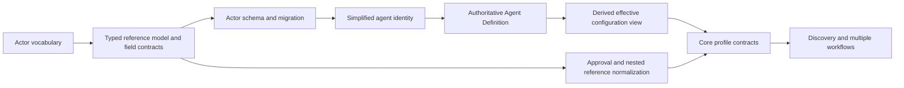

# Foundational Model Cross-RFC Review

## Status

Review complete as of 2026-07-20. The reviewed RFCs remain Draft.

This document records decisions accepted for implementation planning. It does
not accept any RFC in full and does not change current schemas, examples, or
manifest validity.

## Scope

This review covers:

- [RFC-0013: Actor Model](../RFC-0013-actor-model.md)
- [RFC-0014: Effective Agent Configuration](../RFC-0014-effective-agent-configuration.md)
- [RFC-0015: Typed References](../RFC-0015-typed-references.md)
- [RFC-0016: Core Profile And Logical Discovery](../RFC-0016-core-profile-and-discovery.md)

The review evaluates compatibility, safety, migration dependencies, and a
practical implementation order. It does not evaluate runtime implementation
languages or provider integrations.

## Outcome

The four RFCs form one coherent architecture when implemented in dependency
order:

- the Actor Model identifies who participates
- Effective Agent Configuration selects and constrains reviewed AI behavior
- Typed References identify declarations without namespace guessing
- Core Profile and Logical Discovery determine which documents form a project
  assembly

No fundamental conflict requires withdrawing an RFC. The main correction is
implementation order: a common typed-reference primitive and field contracts
must precede the first Actor schema migration. Otherwise actor references would
need an immediate second format migration.

The package is therefore **compatible with conditions**. Its conceptual
directions may guide implementation, but schema work remains gated by the
blockers in this review.

## Dependency Order

Logical assembly can continue to be documented before these steps complete.
The schema migration for reduced profiles and multiple workflows should wait
until participant identity and reference contracts are stable.

## Accepted Planning Decisions

### Actor And Agent Identity

1. `ActorSet` owns common participant identity and actor kind.
2. An actor with `kind: agent` uses an explicit `agentRef` to a stable AI agent
   identity in `AgentSet`.
3. Actor and agent IDs may be equal for readability, but equality must never be
   interpreted as an implicit link.
4. Human, automation, service, and authority participants migrate out of the
   current mixed `AgentSet`.
5. `AgentSet` remains AI-agent-specific and retains stable identity metadata and
   any accepted standing constraints. It does not become a second actor store or
   the source of effective behavior.

The exact final list of common actor fields and standing agent constraints is a
schema blocker, not an identity-model blocker.

### Agent Configuration Authority

1. A selected `AgentDefinitionSet` entry is the authoritative requested
   behavioral release for an AI agent.
2. Model, prompt, retrieval, requested capabilities, context and memory intent,
   requested autonomy, and extension components belong to that release or to
   the resources it references.
3. `PermissionSet` remains authoritative for `allow`, `deny`, and
   `approval_required` effects. Permission references select applicable policy;
   they never grant permission by themselves.
4. Project, actor, task, workflow, human-control, runtime, and sandbox constraints
   may narrow effective behavior. They must not broaden it.
5. Until an explicit scoped binding is standardized, an agent may have at most
   one eligible unscoped active definition. Tools must not infer the active
   definition from version order, file order, modification time, or provider
   availability.
6. Agent Assembly is a derived inspection and review view. It is not another
   authored source of authority.

### Typed References

1. The canonical explicit logical form is an object containing `kind`, `id`, and
   `scope` when the field contract requires scope.
2. A compact `kind:id` string is not part of the initial model.
3. A scalar ID remains valid where a field contract permits exactly one target
   kind in one deterministic scope.
4. Multi-kind fields require an explicit typed object once migrated.
5. `actor` is introduced as a target kind in the same coordinated migration that
   introduces the actor declaration model. It must not resolve before an
   `ActorSet` exists in the selected specification version.
6. Field contracts are normative. Their machine-readable representation should
   be shared by schemas, semantic validators, diagnostics, and generated
   documentation rather than reimplemented independently.

### Core Profile And Discovery

1. The minimum useful profile contains exactly one `Project` and a participant
   inventory.
2. The current participant inventory is `AgentSet`; it moves to `ActorSet` only
   after the Actor Model migration is accepted and implemented.
3. Optional policy or workflow modules do not imply permissive defaults. Omission
   never grants capabilities, permissions, context, memory, autonomy, execution,
   or network access.
4. References create dependency closure: a referenced module is required even
   when the selected profile otherwise marks it optional.
5. Discovery produces a logical manifest assembly before reference resolution.
   File names and paths are transport hints, not resource identity.
6. An initial assembly contains exactly one `Project`, zero or more `Workflow`
   documents with unique workflow IDs, and at most one document for each other
   collection kind.
7. Multiple workflows do not create cross-workflow ordering. Cross-workflow
   dependencies remain unsupported until scoped typed references and graph rules
   are separately accepted.

## Safety Invariants

Every implementation slice covered by these RFCs must preserve the following:

- actor kind, role, reference, discovery, or presence never grants authority
- ambiguous identity, definition selection, reference resolution, or project
  association fails closed
- deny and approval requirements are never erased by composition
- task and workflow requirements are requirements, not grants
- effective configuration output explains its source and constraints
- discovery remains bounded, visible, deterministic, and non-executing
- omitted policy modules never become allow-all policy
- runtime and provider support may narrow declared behavior but cannot broaden it
- credentials and secret material remain outside authored public manifests and
  derived inspection artifacts
- draft examples and draft definitions never become active by declaration order

## Migration Plan

### Phase 1: Vocabulary And Contracts

- accept common actor vocabulary and identity boundaries in documentation
- inventory declaration namespaces and reference fields
- define reusable typed-reference data shapes and field contracts
- add diagnostics for duplicate, ambiguous, and wrong-kind references

This phase can be additive and should keep current manifests valid.

### Phase 2: Actor Identity

- add the candidate `ActorSet` schema only after the common reference primitive
  is available
- add explicit `agentRef` for agent actors
- preserve stable participant IDs where possible
- migrate one maintained example before migrating the complete example set
- keep a documented compatibility path for legacy human entries in `AgentSet`

### Phase 3: Agent Configuration

- reduce `AgentSet` to stable AI identity and accepted standing constraints
- make selected agent definitions authoritative for requested behavior
- enforce the one-active-definition rule for the initial unscoped model
- expose Agent Assembly as derived inspection output with provenance
- defer multi-scope activation until a binding field contract is accepted

### Phase 4: Reference Normalization

- migrate multi-kind approval targets to explicit typed references
- establish workflow-step and artifact namespace contracts
- add semantic fixtures for ambiguity, scope, and wrong-kind failures
- retain scalar IDs for deterministic single-kind fields

### Phase 5: Profiles And Discovery

- introduce logical assembly as a tool-independent model
- define core and optional profile contracts plus dependency closure
- replace the singular workflow path assumption with an accepted source/index
  representation
- add multiple-workflow discovery and duplicate-workflow diagnostics
- keep cross-workflow dependencies unsupported

### Phase 6: Stabilization

- align documentation, schemas, examples, compatibility guidance, and migration
  notes
- stabilize diagnostics needed by a future validation-only CLI
- add conformance fixtures and publish machine-readable schemas
- decide specification version transitions before removing compatibility forms

## Blocker Register

| Blocker | Blocks | Required resolution |
| --- | --- | --- |
| Common typed-reference primitive is not implemented | Actor schema migration and multi-kind participant references | Define reusable object and scalar-compatible forms plus field contracts first. |
| Final common Actor fields are undecided | Normative `ActorSet` schema | Separate identity fields from kind-specific policy and configuration fields. |
| Actor-to-agent bridge is not yet normative | Agent actor schema and resolution | Adopt explicit `agentRef`; never infer the bridge from equal IDs. |
| Remaining `AgentSet` standing constraints are undecided | Complete identity/configuration split | Classify current fields as stable identity, standing ceiling, behavioral release, or deprecated compatibility data. |
| Scoped active-definition binding has no accepted field | Multiple simultaneous active releases per agent | Use one unscoped active definition initially; specify scoped binding separately. |
| Context and memory intent lacks read/write/promotion typing | Complete effective configuration semantics | Define intent without treating access references as grants. |
| Provider support and project action capabilities share ambiguous vocabulary | Provider capability resolution | Separate provider feature support from actor action capability identifiers. |
| `memoryPolicyRef` has no stable target contract | Memory policy selection | Define its target kind and relationship to `MemorySet` before normative use. |
| Approval targets and nested workflow resources lack final contracts | Full typed-reference migration | Define allowed kinds, owner scope, and migration behavior for each field. |
| Normative field-contract storage is undecided | Portable semantic validators | Choose a generated or shared schema-backed registry with one authoritative source. |
| Project source/index shape is undecided | Reduced profile and multiple-workflow schemas | Define a transport-neutral representation that preserves logical assembly semantics. |
| Specification version transition is undecided | First breaking schema migration | Make an explicit coordinated version decision with migration and compatibility notes. |

## Deferred Non-Blockers

The following do not block the initial specification work:

- runtime language or orchestration implementation
- provider adapters and remote provider discovery
- remote manifest discovery, registries, or cross-project references
- compact typed-reference string syntax
- quorum and separation-of-duty authority rules
- short-lived external actor identity
- cross-workflow execution dependencies
- canonical effective-configuration JSON and digest
- complete prompt composition order
- final stable CLI diagnostic set

## Versioning Decision

Publishing this review does not change manifest validity and does not require a
version bump.

The first implementation that changes a manifest shape or gives an existing
field new normative meaning must include, in the same change set:

- an explicit `specVersion` decision
- compatibility and migration notes
- synchronized manifest reference and concept documentation
- synchronized schemas and maintained examples
- validation fixtures for accepted and rejected compatibility forms
- a changelog entry identifying the behavior change

This review does not decide whether the coordinated migration completes the
current `0.1` draft or begins a later manifest version. That decision belongs to
the specification readiness and scope-freeze review. Silent schema drift within
the draft is not acceptable.

## Review Disposition

| RFC | Disposition | Conditions |
| --- | --- | --- |
| RFC-0013 | Direction accepted for planning; remains Draft | Typed-reference primitive first; finalize common fields and explicit `agentRef`. |
| RFC-0014 | Precedence and fail-closed selection accepted for planning; remains Draft | Start with one unscoped active definition; classify remaining standing constraints. |
| RFC-0015 | Logical object form and deterministic field contracts accepted for planning; remains Draft | Define authoritative contract storage and migrate fields deliberately. |
| RFC-0016 | Core profile and logical assembly direction accepted for planning; remains Draft | Stabilize participant inventory and reference contracts before schema migration. |

## Exit Criteria For Schema Work

Schema-changing implementation may begin only when the affected slice has:

- one documented source of truth for every changed field
- an explicit target-kind and scope contract for every changed reference
- compatibility behavior for current `0.1` manifests
- a migration example that preserves identity where possible
- safety tests for ambiguity, omission, denial, and approval requirements
- synchronized documentation, schemas, examples, and changelog updates
